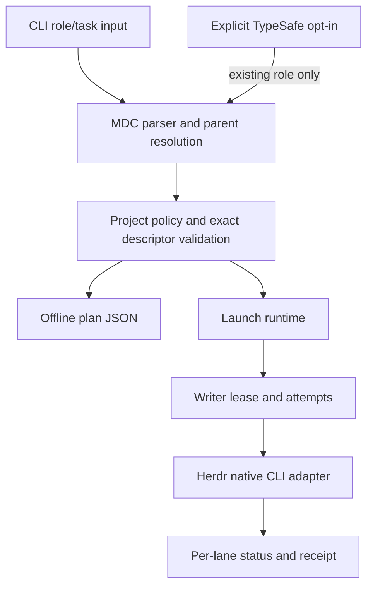
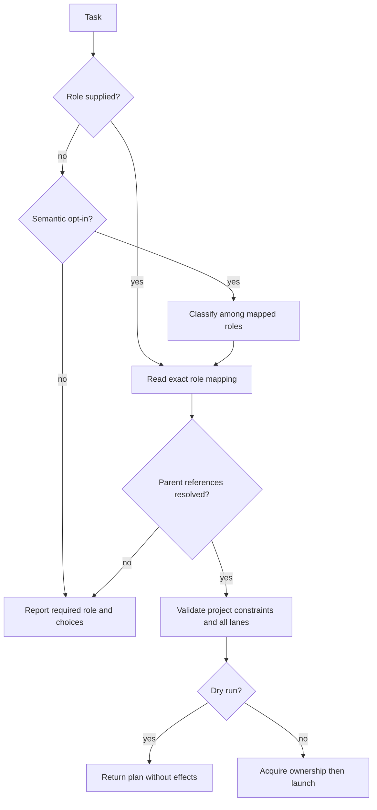
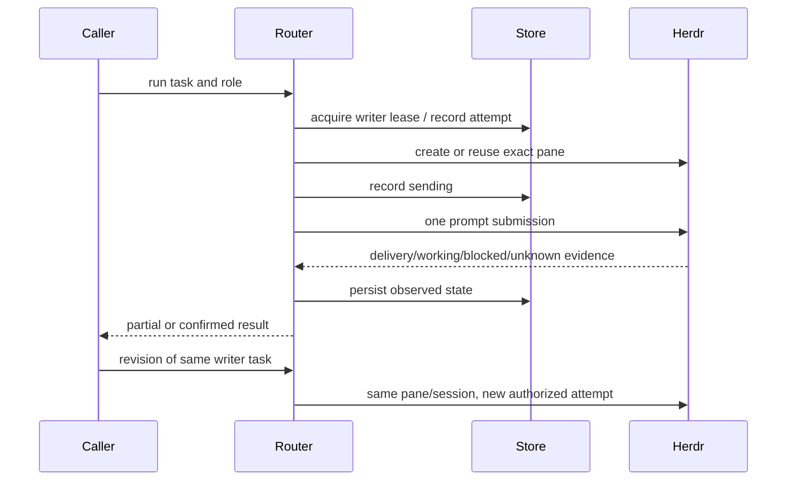
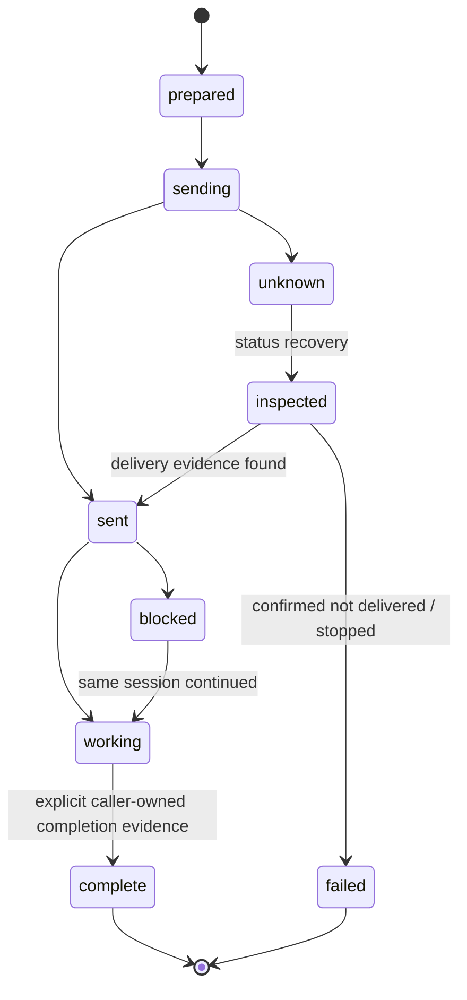

# Herdr subscription role router - Plan

## Goal Capsule

- Objective: 開發者能在 Herdr 用一份可檢視的角色規則，分派自己的 AI 訂閱工作，並透過公開 GitHub repo 共同維護這個工具。
- Means: 從 MIT agent-router 衍生，增加本機規則路由，參考 open-pstack 的 provider 對應與 receipt 設計。見 KTD1、KTD2。
- Authority: 本文件的 R 規定產品行為，KTD 規定實作方式，目標專案明確政策優先於使用者角色表。
- Execution: 單一 Claude writer 依 U1–U6 實作；Codex 擁有設計、獨立審查、驗收、CI 與公開發布。
- Stop conditions: 精確模型或既有登入不可用、派工結果不明、writer ownership 衝突時保留證據，拒絕替代模型、重送或 API 計費。
- Tail: 發布可貢獻的 public GitHub fork 與 reviewable PR，不發布 npm 套件。遵循實際 merge tier gate。

---

## Product Contract

### Summary

建立 Herdr Model Router，預設從 pstack-models.mdc 讀取角色與模型，支援官方 Grok、Codex、Claude Code、Cursor CLI。
TypeSafe 是明確選用的任務分類器，不能成為離線規則路由的必要服務。

### Problem Frame

原版 agent-router 每次路由需要 TypeSafe，且沒有原生 Grok agent。
使用者已有模型角色表與各家訂閱，希望保留這些投資，並公開程式讓其他開發者修改與貢獻。
研究確認可重用 Herdr launcher、eligibility 與 quota reservation，但原 dry-run 仍可能呼叫外部服務或寫入狀態，panel 也未有全部 lane 的執行語意。

### Key Decisions

- 採用現有角色表，TypeSafe 選配。Governs R1, R2, R3。 (session-settled: user-approved — chosen over mandatory TypeSafe routing: 使用者已有模型規則並希望使用既有訂閱。)
- 建立自己的公開衍生 repo，保留 MIT attribution。Governs R12。 (session-settled: user-approved — chosen over starting from scratch: 已調查可重用的 agent-router 與 open-pstack。)

### Requirements

#### Rules and selection

- R1. 本機模式讀取明確指定的 pstack-models.mdc，支援角色別名、單 lane 與有序 panel 清單，重複 lane 必須保留。
- R2. 預設路由不用 TypeSafe；角色已指定時照表選擇，未指定且未 opt-in 時回傳可用角色而不猜測。
- R3. TypeSafe 只能在明確 semantic mode opt-in 後分類到已存在的角色，不能覆寫指定角色、專案模型 pin、effort 或縮減 panel。
- R4. inherit-parent、auto、parent 解析為明確提供或可信 Herdr context 的 parent descriptor；資訊不足時拒絕模型派工。
- R5. 目標專案政策可限制 provider、精確 model、effort 與 writer role；衝突時明確失敗，不能默默降級或改用付費 API。

#### Execution and observability

- R6. 支援 Grok、Codex、Claude Code、Cursor 的原生 CLI，沿用各 CLI 自己管理的登入；router 不讀取、儲存、複製或修改訂閱憑證。
- R7. panel 是全部 read-only lanes；每 lane 使用獨立輸出識別與狀態，單一 lane 失敗保留其餘結果，總結果不得宣稱全部成功。
- R8. 同 worktree 同時只允許一個 writer task，lease 跨審查與修正保留；同 task 的修正使用原 agent/pane/session，不改模型或重新啟動 writer。
- R9. 每 attempt 的 prompt 至多送一次；unknown、timeout、blocked 的傳送不重送，需 status／recovery 檢視證據。
- R10. roles／plan／run --dry-run 在本機模式只讀規則與非機密設定，不讀 Keychain／provider 憑證、不啟動外部 CLI、不連網、不建立 DB、worktree、reservation 或 pane。
- R11. 提供 JSON 與人類可讀的決策及結果，包含 role、規則來源、provider/model/effort、cwd、所有 lanes、拒絕理由與派工狀態；不得輸出 credentials 或宣稱 pane idle 是實作完成。

#### Public collaboration

- R12. 公開 repo 包含可跑的測試與 CI、README、貢獻指南、security policy、issue／PR templates、乾淨的範例與上游授權，發布前查核 tracked content 沒有本機登入、私人 receipts 或個人設定。

### Acceptance Examples

- AE1. Covers R1, R4, R10。一份 feature/refactoring 別名與三 lane reviewers 的 fixture，在無 API key 的離線預覽得到同樣 model/effort，panel 順序與數量保持原樣。
- AE2. Covers R2, R3, R5。有 TYPESAFE_API_KEY 但沒 opt-in，仍零 API；explicit role 與專案 model pin 不被 semantic 結果覆寫。
- AE3. Covers R8, R9。同 writer task 修正使用原 pane，另一個 task 被 lease 拒絕；send timeout 後 status 回報不明，不能重送。
- AE4. Covers R7, R11。三 lane panel 其中一條 blocked，輸出列出每條 lane 狀態與 partial outcome，不產生寫入 checkout 的權限。

### Scope Boundaries

公開 CLI source 與 GitHub collaboration 是本次交付。
不新建推論 API、登入 broker、付費分類器帳號或遠端 deployment。

#### Deferred to Follow-Up Work

- 用真實 coding workload 衡量自動分類品質與用量；本次只驗證路由行為，不宣稱節省多少額度或提升成果品質。
- npm 發布、web dashboard、所有供應商精確剩餘額度 API，以及跨帳號憑證輪替。

---

## Planning Contract

### Key Technical Decisions

- KTD1. 延伸既有 router 的 domain／policy／launch seams，讓本機角色選擇與 TypeSafe 分類共用同一份已解析路由結果。它們不可各自持有可漂移的模型政策。Realizes R1–R5。
- KTD2. provider-qualified descriptor 為新範例格式；保留已知 legacy pstack selectors 的明確轉換。精確 native model 不使用 rolling alias 重寫。Realizes R1, R4, R6。參考 open-pstack provider-dispatch；legacy Grok 的 fast 無 native 等效時需明確顯示差異。
- KTD3. TypeSafe 只處理角色分類；數學、quota gate 與允許清單留在純函式。已有環境 key 不能啟用服務。Realizes R3, R5。
- KTD4. plan／dry-run 是不同於 launch runtime 的入口，不能透過先建 DB 再 rollback 假冒零寫入。Realizes R10。
- KTD5. 延伸既有 durable session／reservation storage 加入 task ownership 與 attempt state，區分 quota 預留和 writer lease。Realizes R8, R9, R11。原 session continuation 開新 pane 的行為不可作為 writer revision。
- KTD6. 父程序只傳必要 environment 名稱與當前 Herdr context；不用 shell eval 拼接 model／role／prompt。Realizes R6, R11。open-pstack issue #141 為已觀察到的負面先例。
- KTD7. 本機規則模式不以 quota 未知代表零額度或可自動換模型；personal unknown 可保守提示，shared reservation 仍遵循既有 hard gate。Realizes R5, R11。
- KTD8. TypeSafe SDK 可保留為選配，但使用說明明列 API 計費與傳送的 task 摘要；未取得 opt-in 不初始化 live client。Realizes R3。

### High-Level Technical Design

Descriptor 語意如下；這是 grammar sketch，實作者以 Zod 等邊界驗證落實。

| Input                          | Meaning                                    |
| ------------------------------ | ------------------------------------------ |
| provider:model@effort          | 明確 native route                          |
| 已知 legacy selector           | 明確解析 family/model/effort，差異列入決策 |
| parent / auto / inherit-parent | 解析本次提供的 parent descriptor           |
| comma-separated role names     | 每個名稱指向同一 lane 清單                 |
| comma-separated panel entries  | 每一項是一條 lane，不是候選選一            |

### Assumptions

- 新 GitHub repo 名稱使用 herdr-model-router；CLI 可保留 router 相容入口並加入不衝突的 hmr 入口。
- 第一版以顯式 role 取得可重現結果，不以 keyword heuristic 假裝已驗證的自然語意分類。
- 公開 README 延續上游英文，使用者回報與本計畫使用台灣繁中。
- 不依賴私有 agent-collab 安裝讓社群使用；本次開發 writer 由既有 agent-collab 管理，產品本身使用可攜的本機 ownership。

### Sources and Risks

- Baseline: nidhi-singh02/agent-router fb24d06a62fb33a92c7836b4920ae9f4b1216c63，MIT。
- 本 repo 的 config-loader.ts、commands/runtime.ts、commands/run.ts、launch/herdr-launcher.ts 已作為 integration seams 檢視。
- docs/superpowers/specs/2026-09-17-security-reliability-hardening-design.md 的 transaction／environment boundary 仍適用；TypeSafe 必要依賴已由 R2、R3 取代。
- [open-pstack provider dispatch](https://github.com/ericlitman/open-pstack/blob/main/plugins/pstack/skills/poteto-mode/references/provider-dispatch.md) 決定 KTD2。
- [open-pstack environment issue](https://github.com/ericlitman/open-pstack/issues/141) 決定 KTD6。
- [TypeSafe model pricing](https://docs.typesafe.ai/models) 決定 R3 的 opt-in 邊界，不能把 SDK 存在視為用戶授權。
- CLI 與 Herdr 版本可能不同；live doctor／smoke 要保留精確 argv 與 metadata，不能從 catalog 宣稱已完成推論。
- 原有 private receipts、runtime db、keychain references 不得帶入 tracked 範例；CI 使用 synthetic fixtures 與 fake executables。

---

## Implementation Units

### U1. Offline role rules and portable descriptors

- Goal: 提供不需 TypeSafe 的角色解析與 plan。
- Requirements: R1, R2, R4, R5, R10, AE1。
- Dependencies: none。
- Files: packages/router/src/config/、packages/router/src/domain/、packages/router/src/cli.ts、新增 rules/ 解析模組與 packages/router/test/rules/、test/cli/ 的測試。
- Approach: 延伸 Zod 邊界驗證與 argv builder，讓全部 lanes 共用已解析的 descriptor。
- Test scenarios:
  1. YAML frontmatter、comments、role aliases、空白、三種 parent aliases 可正確解析。
  2. 三 lane panel 含重複模型仍保留順序與數量。
  3. unknown role、malformed selector、重複 role定義與缺 parent 回傳明確錯誤。
  4. 專案 exact pin 不符時不能輸出 launchable plan。
  5. Covers AE1。用假的 HOME 與規則 fixture 預覽時零外部呼叫／持久寫入。
- Verification: 解析及 CLI integration tests 的 literal lane 結果符合 fixture。

### U2. Rules-first execution and opt-in classification

- Goal: 預設 route 完全使用本機規則，semantic 模式仍遵守同一政策。
- Requirements: R2, R3, R5, R10, AE2。
- Dependencies: U1。
- Files: packages/router/src/commands/runtime.ts、commands/run.ts、semantic/、config/config-schema.ts，test/commands/runtime.test.ts、test/cli/run.test.ts 與 semantic tests。
- Approach: 分離離線 plan runtime 與 launch runtime，TypeSafe 選用分類傳回 role，不再排名或改寫已指定模型。
- Test scenarios:
  1. 沒 key 以及有 key 未 opt-in 均可規則路由，零 TypeSafe calls。
  2. Covers AE2。semantic output 超出 role集合或試圖改 model/effort 時拒絕。
  3. explicit role 跳過 classifier；semantic opt-in 缺 key 或 outage 明確失敗而非啟動替代 provider。
  4. run --dry-run 不建立 SQLite、reservation、Keychain query、外部 CLI 或 pane。
- Verification: 既有 mode 相容 tests 與新 rules mode integration tests通過。

### U3. Native providers and complete panel launch

- Goal: 在 Herdr 啟動 exact native lanes，支援原生 Grok。
- Requirements: R6, R7, R11, AE4。
- Dependencies: U1, U2。
- Files: packages/router/src/launch/、domain/ids.ts、collectors/registry.ts，test/launch/ 與新增 panel tests。
- Approach: 使用 injectable HerdrClient，公開 native argv builder；不要把 Cursor Grok selector 與原生 Grok kind 混稱。
- Test scenarios:
  1. Grok／Codex／Claude／Cursor 的 exact model／effort argv 與 access mode 均有 literal assertion。
  2. missing executable 或 provider-reported unavailable model 不切 API key 或另一模型。
  3. Covers AE4。三 lane panel 全部嘗試，部分失敗有每 lane 記錄與 partial總結果。
  4. read-only panel commands不含 bypass旗標，不把父程序機密環境傳給worker。
- Verification: fake native CLI integration 與 Herdr client tests；逐家核對已安裝版本的 argv／model／effort，另記錄實際可見 read-only smoke。無法完成 live 驗證的 provider 必須標示未驗證，不能以 fake test 冒稱真實派工通過。

### U4. Writer ownership and at-most-once revisions

- Goal: writer task 的 session／模型與 prompt attempt可查核且不能重送。
- Requirements: R8, R9, R11, AE3。
- Dependencies: U3。
- Files: packages/router/src/store/、sessions/、launch/herdr-launcher.ts、commands/，test/reservations/、test/sessions/、test/launch/。
- Approach: 依 KTD5 增加 ownership 與 attempt records；留住原 quota reservation transaction。
- Test scenarios:
  1. 多 connection 同時要求同 worktree writer，只有一個取得 lease。
  2. Covers AE3。同 task revision 使用原 pane／model，另一task不能借用原lease。
  3. sending 後 crash／timeout／unknown 不重送；restart status 能看見前一 attempt。
  4. 明確結束或已停止 writer後才能release ownership；idle本身不代表實作完成。
  5. read-only panel不取得writelease，不能與writer共用寫入權限。
- Verification: 真正本機 storage concurrency 與fake Herdr lifecycle integration證據。

### U5. Public project identity and contributor workflow

- Goal: 社群能從乾淨 clone 安裝、理解規則並提交 PR。
- Requirements: R12。
- Dependencies: U1–U4。
- Files: README.md、CONTRIBUTING.md、SECURITY.md、NOTICE.md、AGENTS.md、package.json、examples/、.github/workflows/verify.yml、.github/ISSUE_TEMPLATE/、.github/pull_request_template.md、herdr-plugin.toml 與必要 package metadata。
- Approach: 保留上游 MIT聲明與history，examples只用synthetic identities；寫明本人訂閱由官方CLI計費，router不承諾額度或帳號權限。
- Test scenarios:
  1. clean checkout 的 npm ci 與 verify 在 CI 能跑。
  2. 文件中的 rules-preview command 使用 fixture 在無登入／key 環境能完成。
  3. public source 沒有 personal rule檔、credentials、runtime db、private auditreceipt。
- Verification: 安裝／README smoke與publication content inventory，不另建鏡像文件測試。

### U6. Independent acceptance and public delivery

- Goal: 公開可審查且具驗證證據的 fork。
- Requirements: R11, R12。
- Dependencies: U1–U5。
- Files: CODEX-VERDICT.md 與必要 reviewable release notes；公共文件不能包含本機 run token。
- Approach: Codex檢查 baseline-to-final diff，獨立 verify writer停止後進行，CI通過後走實際tiergate。若需Kai GO則保留public PR與完整證據，不繞過。
- Test expectation: none。交付 gate 重用相關已通過驗證，避免鏡像實作測試。
- Verification: publicvisibility、head SHA、CI結果與PR內容均可由GitHub核對。

---

## Verification Contract

| Gate                 | Command or evidence                          | Units  | Required result                                        |
| -------------------- | -------------------------------------------- | ------ | ------------------------------------------------------ |
| Install              | npm ci                                       | U1–U5  | locked dependencies 可安裝，不讀providercredentials    |
| Repository checks    | npm run verify                               | U1–U5  | typecheck、lint、format、tests、build通過              |
| Offline behavior     | CLI integration fixtures                     | U1, U2 | zero provider/network/keychain/process/state effects   |
| Dispatch correctness | fake Herdr/native executables                | U3, U4 | exact argv、全部panel、單writer、不重送                |
| Live integration     | 四家CLI capability查核與可見 read-only smoke | U3     | 每家支援／未驗證狀態獨立呈現，真正pane／cwd／agent匹配 |
| Independent review   | baseline diff與verifier receipt              | U6     | 無未解correctness／security blockers                   |
| Public delivery      | GitHub visibility、PR head、CI、merge gate   | U6     | 保留上游授權，可開issue／PR，必要gate通過              |

## Definition of Done

- U1: offline role parsing、parent解釋與policy拒絕有behavior證據。
- U2: rules mode不需key；TypeSafe唯有明確opt-in啟動。
- U3: four native providers和全部read-onlypanel可檢視。
- U4: writer修正留在同session，unknown送達不重送，ownership可恢復。
- U5: publicREADME／examples／contributors／security／CI／license完成。
- U6: 獨立review與CI證據存在，repo及PR公開，任何mergeblocker照實保留。
- 移除未採用的實驗程式與stubs，保留既有無關文件與私有本機狀態。

## Execution status

- U1–U5：完成。預設離線角色規則、選配語意分類、原生 CLI 派工、ownership／attempt 與公開協作文件均已實作。
- 審查修正：五項已驗證的 correctness／security findings 已修正，包含 SQLite transaction ownership guard、真實 provider process 的環境隔離及所有 alias pins 的檢查。
- 驗證：`npm run verify` 通過，71 個測試檔案／619 個測試，包含 typecheck、lint、format 與 build。移除 ownership guard 或 `env -i` 時，相對應的回歸測試會失敗。
- 公開內容：tracked snapshot 掃描沒有新增憑證或私人設定；唯一 scanner 命中是與 upstream baseline 完全相同的合成測試 fixture。
- U6：公開 fork 已建立於 [waveriderai/herdr-model-router](https://github.com/waveriderai/herdr-model-router)，Issues、Discussions 與 private vulnerability reporting 已啟用。獨立真實 Herdr 驗證與 PR CI 尚待完成。
- 下一步：記錄各 provider 的實際支援／未驗證結果，建立同 repo 公開 PR，確認該 head 的 CI 後執行 tier gate。本 repo 的程式路徑屬未映射 scope，若 gate 判為 tier 3，保留可審查的公開 PR 並等待該 head 的 Kai GO。
