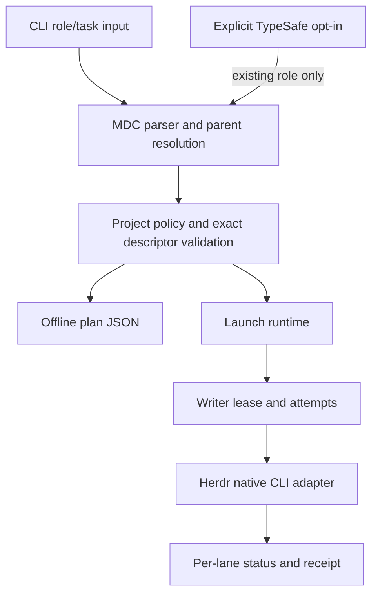
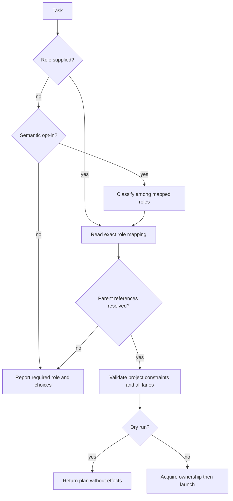
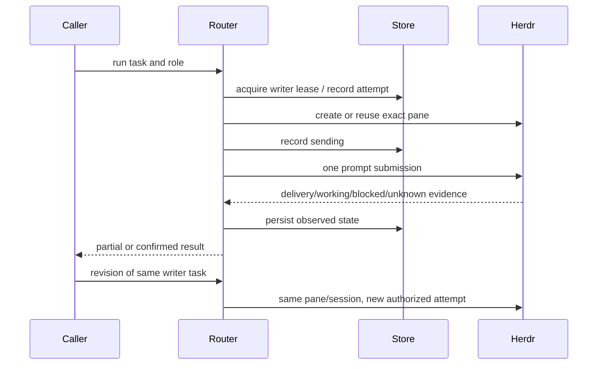
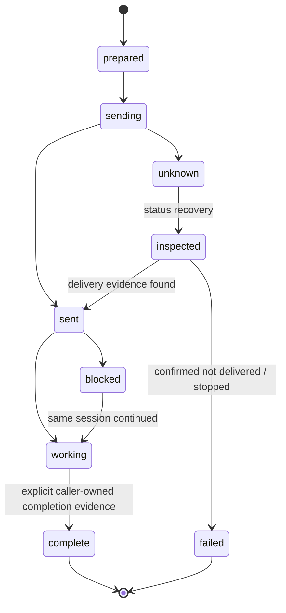
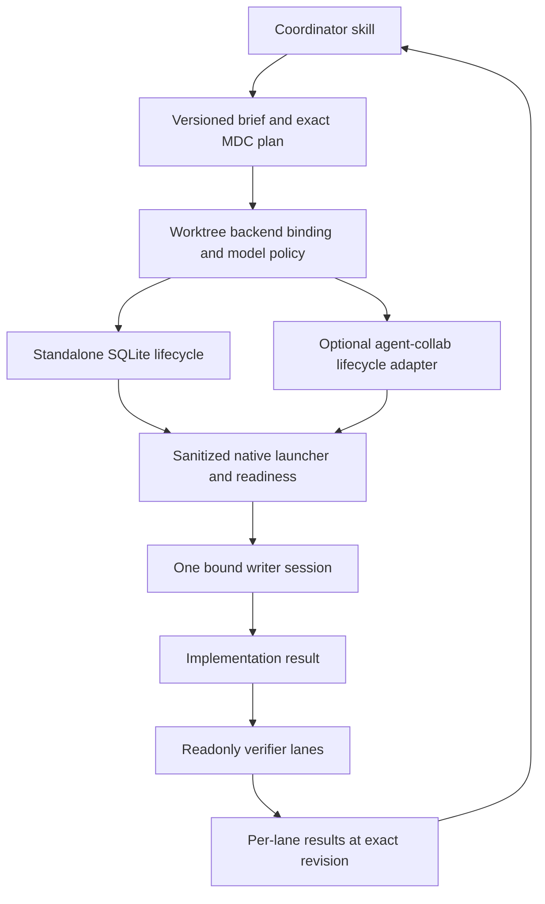
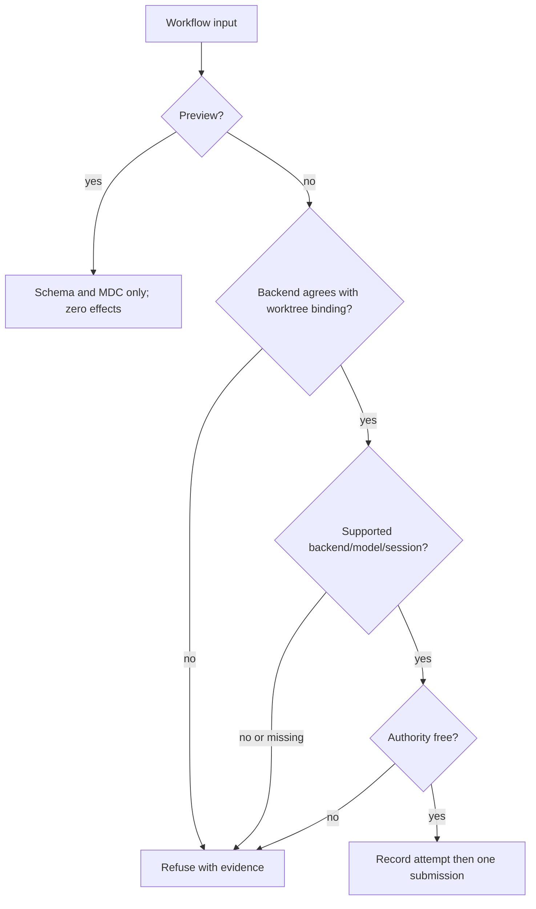

# Herdr subscription role router - Plan

## Goal Capsule

- Objective: 開發者能在 Herdr 用一份可檢視的角色規則，分派自己的 AI 訂閱工作，並透過公開 GitHub repo 共同維護這個工具。
- Means: 從 MIT agent-router 衍生，增加本機規則路由，參考 open-pstack 的 provider 對應與 receipt 設計。見 KTD1、KTD2。
- Authority: 本文件的 R 規定產品行為，KTD 規定實作方式，目標專案明確政策優先於使用者角色表。
- Execution: 單一 Claude writer 依尚未交付的 U9–U12 實作；Codex 擁有設計、獨立審查、驗收、CI 與公開發布。
- Stop conditions: 精確模型或既有登入不可用、派工結果不明、writer ownership 衝突時保留證據，拒絕替代模型、重送或 API 計費。
- Tail: 發布可貢獻的 public GitHub fork 與 reviewable PR，不發布 npm 套件。遵循實際 merge tier gate。

---

## Product Contract

### Summary

建立 Herdr Model Router，預設從 pstack-models.mdc 讀取角色與模型，支援官方 Grok、Codex、Claude Code、Cursor CLI。
TypeSafe 是明確選用的任務分類器，不能成為離線規則路由的必要服務。

### Problem Frame

原版 agent-router 每次路由需要 TypeSafe，且沒有原生 Grok agent。
使用者已有模型角色表與各家訂閱，希望保留這些投資，並公開程式讓其他開發者修改與貢獻。
研究確認可重用 Herdr launcher、eligibility 與 quota reservation，但原 dry-run 仍可能呼叫外部服務或寫入狀態，panel 也未有全部 lane 的執行語意。

### Key Decisions

- 採用現有角色表，TypeSafe 選配。Governs R1, R2, R3。 (session-settled: user-approved — chosen over mandatory TypeSafe routing: 使用者已有模型規則並希望使用既有訂閱。)
- 建立自己的公開衍生 repo，保留 MIT attribution。Governs R12。 (session-settled: user-approved — chosen over starting from scratch: 已調查可重用的 agent-router 與 open-pstack。)

### Requirements

#### Rules and selection

- R1. 本機模式讀取明確指定的 pstack-models.mdc，支援角色別名、單 lane 與有序 panel 清單，重複 lane 必須保留。
- R2. 預設路由不用 TypeSafe；角色已指定時照表選擇，未指定且未 opt-in 時回傳可用角色而不猜測。
- R3. TypeSafe 只能在明確 semantic mode opt-in 後分類到已存在的角色，不能覆寫指定角色、專案模型 pin、effort 或縮減 panel。
- R4. inherit-parent、auto、parent 解析為明確提供或可信 Herdr context 的 parent descriptor；資訊不足時拒絕模型派工。
- R5. 目標專案政策可限制 provider、精確 model、effort 與 writer role；衝突時明確失敗，不能默默降級或改用付費 API。

#### Execution and observability

- R6. 支援 Grok、Codex、Claude Code、Cursor 的原生 CLI，沿用各 CLI 自己管理的登入；router 不讀取、儲存、複製或修改訂閱憑證。
- R7. panel 是全部 read-only lanes；每 lane 使用獨立輸出識別與狀態，單一 lane 失敗保留其餘結果，總結果不得宣稱全部成功。
- R8. 同 worktree 同時只允許一個 writer task，lease 跨審查與修正保留；同 task 的修正使用原 agent/pane/session，不改模型或重新啟動 writer。
- R9. 每 attempt 的 prompt 至多送一次；unknown、timeout、blocked 的傳送不重送，需 status／recovery 檢視證據。
- R10. roles／plan／run --dry-run 在本機模式只讀規則與非機密設定，不讀 Keychain／provider 憑證、不啟動外部 CLI、不連網、不建立 DB、worktree、reservation 或 pane。
- R11. 提供 JSON 與人類可讀的決策及結果，包含 role、規則來源、provider/model/effort、cwd、所有 lanes、拒絕理由與派工狀態；不得輸出 credentials 或宣稱 pane idle 是實作完成。

#### Public collaboration

- R12. 公開 repo 包含可跑的測試與 CI、README、貢獻指南、security policy、issue／PR templates、乾淨的範例與上游授權，發布前查核 tracked content 沒有本機登入、私人 receipts 或個人設定。

#### Coordinator and worker workflow

- R13. 每個 worktree 明確選擇 standalone 或 agent-collab writer authority；全部 HMR writer 入口遵守同一設定，active task 不可換 backend，選用 backend 不可用時拒絕。
- R14. coordinator 能用 workflow plan／start／status／result／verify／revise／accept／delivery／release／recover 完成多模型任務；每項操作提供穩定 JSON 與目前可執行的下一步。
- R15. brief 與 result 為版本化本機 artifact，綁定 task／attempt／lane、baseline／final revision（HEAD 加 tracked／非忽略 untracked 內容 fingerprint）、角色及 exact descriptor；舊 attempt、錯誤 identity 或已變更的驗證版本不能用來驗收。
- R16. implementation receipt、獨立 verification、coordinator acceptance、授權交付與 release 分開記錄；writer 停手後才啟動 readonly verifier，結果不足、HEAD 或工作內容改變時不能 accept；純本機任務可明確記錄 delivery 不適用。
- R17. 初次 writer prompt 與每次 revision 前核對原 name／kind／pane／非空 session／canonical cwd；缺失、變更或不明送達均拒送，所有 mutation 對目前 attempt 做原子檢查。
- R18. coordinator 技能以短 brief 派工並收集每 lane 結果，遵守現有任務授權繼續流程；worker 不自行 accept、release 或交辦下一階段，panel 部分失敗不能被合併成成功。
- R19. plaintext brief/result 只保存於私人 runtime artifact；owner capability 與其指紋不進普通 JSON、SQLite task view、prompt、公開 source 或 logs，預覽仍遵守 R10。

### Acceptance Examples

- AE1. Covers R1, R4, R10。一份 feature/refactoring 別名與三 lane reviewers 的 fixture，在無 API key 的離線預覽得到同樣 model/effort，panel 順序與數量保持原樣。
- AE2. Covers R2, R3, R5。有 TYPESAFE_API_KEY 但沒 opt-in，仍零 API；explicit role 與專案 model pin 不被 semantic 結果覆寫。
- AE3. Covers R8, R9。同 writer task 修正使用原 pane，另一個 task 被 lease 拒絕；send timeout 後 status 回報不明，不能重送。
- AE4. Covers R7, R11。三 lane panel 其中一條 blocked，輸出列出每條 lane 狀態與 partial outcome，不產生寫入 checkout 的權限。

- AE5. Covers R13–R19。一個 Claude writer 完成後，readonly Codex／Grok verifier 分別回報；coordinator 收集 exact revision 的結果，要求修正回原 writer session，再重新驗證與 accept，lease 直到交付後 release 才結束。
- AE6. Covers R13, R17, R19。agent-collab backend 缺失、模型政策衝突、acquire 回應中斷或 session 變更時，status 保留已知／unknown 證據，不另取 standalone lease、不重新啟動或重送。

### Scope Boundaries

公開 CLI source 與 GitHub collaboration 是本次交付。
不新建推論 API、登入 broker、付費分類器帳號或遠端 deployment。

#### Deferred to Follow-Up Work

- 用真實 coding workload 衡量自動分類品質與用量；本次只驗證路由行為，不宣稱節省多少額度或提升成果品質。
- npm 發布、web dashboard、所有供應商精確剩餘額度 API，以及跨帳號憑證輪替。
- 跨 host／headless backend、自動建立多個 writer worktrees、MCP／ACP／A2A 協定服務與無 coordinator 決策的全自動排程。

---

## Planning Contract

### Key Technical Decisions

- KTD1. 延伸既有 router 的 domain／policy／launch seams，讓本機角色選擇與 TypeSafe 分類共用同一份已解析路由結果。它們不可各自持有可漂移的模型政策。Realizes R1–R5。
- KTD2. provider-qualified descriptor 為新範例格式；保留已知 legacy pstack selectors 的明確轉換。精確 native model 不使用 rolling alias 重寫。Realizes R1, R4, R6。參考 open-pstack provider-dispatch；legacy Grok 的 fast 無 native 等效時需明確顯示差異。
- KTD3. TypeSafe 只處理角色分類；數學、quota gate 與允許清單留在純函式。已有環境 key 不能啟用服務。Realizes R3, R5。
- KTD4. plan／dry-run 是不同於 launch runtime 的入口，不能透過先建 DB 再 rollback 假冒零寫入。Realizes R10。
- KTD5. 延伸既有 durable session／reservation storage 加入 task ownership 與 attempt state，區分 quota 預留和 writer lease。Realizes R8, R9, R11。原 session continuation 開新 pane 的行為不可作為 writer revision。
- KTD6. 父程序只傳必要 environment 名稱與當前 Herdr context；不用 shell eval 拼接 model／role／prompt。Realizes R6, R11。open-pstack issue #141 為已觀察到的負面先例。
- KTD7. 本機規則模式不以 quota 未知代表零額度或可自動換模型；personal unknown 可保守提示，shared reservation 仍遵循既有 hard gate。Realizes R5, R11。
- KTD8. TypeSafe SDK 可保留為選配，但使用說明明列 API 計費與傳送的 task 摘要；未取得 opt-in 不初始化 live client。Realizes R3。

- KTD9. worktree execution 設定與 durable backend binding 固定唯一 writer authority，與 model policy 分開；legacy run/task 也遵守 binding，存在舊 lease 或 active workflow 時拒絕切換。binding 是 router home SQLite 內以 worktreeIdentity 為鍵的一列，首次 writer 取得 authority 時在同一 IMMEDIATE transaction 寫入並檢查；設定只來自使用者命令／router home，不讀 tracked repo 檔，repo policy 只能縮小模型。agent-collab 模式的 HMR store 只保存 reference，不建立 SQLite writer lease。Realizes R13, R17。直接使用其他工具須遵守同一工作樹 authority，HMR 不宣稱能控制未經它的 arbitrary writer；同一 OS 使用者的程序屬於信任邊界內，HMR 只做 defense-in-depth（例如拒絕從已綁定 worker／verifier pane 呼叫 coordinator mutation），不宣稱 OS 隔離。quota run（含新 pane、`--worktree`、`--session` 與 in-place continuation）在送出 handoff 前，以同一個 createTask IMMEDIATE transaction 取得 writer task ownership，並持有到 `task complete`／`task release` 為止；同一 session chain 在同一 worktree 延續原 task，launch 在送出前失敗才歸還。in-place 以目標 pane 的 live cwd 為準。rules-mode writer lane 在第一次 prompt 前記錄 native session／cwd／name，每次 revise 都完整比對；沒有身份紀錄的舊 lane 拒絕延續。workflow 擁有的 task 由 store 層拒絕外部 close／recover／revision，不依賴呼叫端是否傳入依賴。
- KTD10. 抽出 native provisioning／readiness seam，沿用 env -i、exact argv 與 dialog refusal；agent-collab 只接 ownership／attempt／dispatch 紀錄／receipt／revision／accept／release，不用其 provision 取代原生啟動。collab 模式下 HMR 完成 native startup 與 identity／readiness／dialog guard 後，由 adapter 以單次 `agent-collab dispatch`（不帶 retries）作為唯一 prompt sender，HMR 不另行直接送 prompt，否則 backend receipt 會拒絕。standalone 維持先取 lease 再 startup；collab 因 acquire 需要已綁定 agent／pane／session，採 startup（無 prompt）再 acquire，acquire 失敗須關閉本次新 pane，關閉不明時回報 orphan 證據。首版 collab writer 限 Claude（standalone writer 仍依 R6 支援的 provider）；MDC 的 model 與 effort 均先經 project policy 驗證，衝突即拒絕，native launcher 只套用已解析的值。Realizes R5, R6, R13, R17。collab start 在建立任何 pane 前先以唯讀 `agent-collab verify` 與 `project` 預檢：worktree 身份須一致，writer 精確 model 須等於政策 `default`；只有 brief 明確標示 `bounded-small-fix` 時才等於 `bounded_small_fix`，僅屬 allowed 不足以判定。dispatch 以 `--wait --until working --until blocked` 做有界的接收觀察，不等待任務完成。新 pane 關閉經確認才可視為已回滾；未確認時保留 lease 為 unknown 供檢查。
- KTD11. workflow brief/result 採 strict versioned boundary schema 與私人 artifact（router home 下目錄 0700、檔案 0600，不在目標 worktree 內），state transition 沿用 SQLite transaction 並以新 migration 建新表，不放寬既有 dispatch 表的 CHECK；standalone 具 receipt／verify／accept 後另行 release，不能以 attempt 或 legacy `task complete` 提早關 workflow。revision 由 HEAD 與 content fingerprint 組成；content fingerprint 只涵蓋 tracked 與非忽略 untracked 檔案內容，交付 commit 可前進 HEAD，但 delivery 必須核對 content fingerprint 等於 accepted 值，且 accepted HEAD 為新 HEAD 的祖先。Realizes R14–R19。每個 coordinator 步驟在任何 await 之前，於 workflow 列以 CAS 取得 operation slot，之後的狀態寫入都核對 slot 仍屬自己，且不覆寫終態；同主機已不存在的 process 留下的 slot 可接手。這不是第二把 writer lease。Git delivery 以指定 commit（預設 HEAD）自身 tree 的 content fingerprint 比對 accepted 值，不採用 working-tree bytes；not-applicable 需 HEAD 與內容皆未變。router home 若以 real path（含 symlink alias）落在目標 checkout 內，於建立任何 DB／artifact 前拒絕。artifact 重寫僅在內容完全相同時沿用，不同即結構化拒絕。
- KTD12. agent-collab adapter 透過可注入 argv subprocess、有界 timeout 與 validated allowlisted response 操作；subprocess 只收到 PATH、HOME、HERDR_* context 等 allowlist 環境，不收 provider 憑證或完整父環境；executable 從使用者 PATH 或 router home 設定解析。owner token 單獨以 router home 下 user-only 檔持有，不進 prompt、JSON、SQLite、logs 或 smoke 證據；現行 agent-collab 只接受 `--owner` argv，傳輸期間同一使用者程序可見，列為選用私人 backend 的已接受邊界，不修改該工具。每項外部 mutation 先記 durable pending intent，再呼叫並保存 observed outcome；crash 後只以 backend status 核對，未知不 replay。acquire 成功但 capability 未保存的 window 回報 unknown／manual recovery，不重試 acquire。adapter 使用的 acquire／status／dispatch／receipt／request-changes／accept／release 指令與欄位以其 README 契約為準，fake fixture 依此建構。Realizes R9, R13, R19。intent 記錄 operation、attempt、backend attempt 與預期效果（不含 secret），未解決的 intent 以 unique index 擋下同 workflow 其他外部 mutation。recover 以已知 run／attempt 的唯讀 status 對 dispatch、receipt、request-changes、accept、release 逐項判定 applied／not-applied／unclear，applied 才寫入本機，unclear 保持 unknown，皆不 replay。standalone 與 collab 的 attempt 在送出前已連結 backend attempt。
- KTD13. coordinator skill 是自然語言任務入口，workflow CLI 提供可組合而可稽核的 steps；AI coordinator 決定拆解／審查，程式執行狀態 gate。參考 [Cursor context isolation](https://cursor.com/docs/subagents) 與 [Anthropic composable workflows](https://www.anthropic.com/engineering/building-effective-agents)，不宣稱複製 Cursor Auto 或符合未實作的通訊協定。Realizes R14, R18。

### High-Level Technical Design









Descriptor 語意如下；這是 grammar sketch，實作者以 Zod 等邊界驗證落實。

| Input                          | Meaning                                    |
| ------------------------------ | ------------------------------------------ |
| provider:model@effort          | 明確 native route                          |
| 已知 legacy selector           | 明確解析 family/model/effort，差異列入決策 |
| parent / auto / inherit-parent | 解析本次提供的 parent descriptor           |
| comma-separated role names     | 每個名稱指向同一 lane 清單                 |
| comma-separated panel entries  | 每一項是一條 lane，不是候選選一            |

下列為後續 workflow 的方向性設計，實作者可按既有 seams 調整模組位置，不能改變 R13–R19。

```mermaid
stateDiagram-v2
  [*] --> prepared
  prepared --> dispatched: one attempt
  dispatched --> unknown: send unclear
  dispatched --> receipt: explicit implementation result
  receipt --> verifying: writer stopped
  verifying --> reviewed: all required lane results
  reviewed --> revision: coordinator requests changes
  revision --> dispatched: same session, new attempt
  reviewed --> accepted: exact revision evidence
  accepted --> revision: delivery gate needs changes (acceptance reopened, history kept)
  accepted --> delivered: authorized delivery evidence
  accepted --> delivered: explicit delivery not-applicable (local-only task)
  delivered --> released: writer stopped, release authority
  unknown --> inspected: readonly recovery
  inspected --> dispatched: delivery evidence found; no resend
  inspected --> aborted: confirmed not delivered or safe stop
  released --> [*]
  aborted --> [*]
```





```mermaid
sequenceDiagram
  participant Parent as Coordinator
  participant Router as HMR
  participant Backend as Selected authority
  participant Worker as Native writer
  Parent->>Router: brief and explicit roles
  Router->>Backend: standalone: acquire before startup
  Router->>Worker: startup without task; bind ready session/cwd
  Router->>Backend: collab: policy check / unique acquire with bound session
  Router->>Worker: identity/readiness/dialog guards
  Router->>Backend: collab: one agent-collab dispatch (sole sender)
  Router->>Worker: standalone: one prompt submission
  Worker-->>Parent: structured result
  Parent->>Router: validate and record current-attempt result
  Router->>Backend: receipt (lease remains held)
  Router->>Worker: confirm writer stopped (complete identity match, status idle or done, fingerprint unchanged)
  Parent->>Router: verify exact revision with readonly role
  Router-->>Parent: verification lane results
  Parent->>Router: explicit accept
  Router->>Backend: accept; lease remains held
  Parent->>Router: delivery evidence or explicit not-applicable
  Router->>Backend: release after identity and stopped checks
```



| Contract          | Minimum fields / meaning                                                                                           |
| ----------------- | ------------------------------------------------------------------------------------------------------------------ |
| Brief             | version, task identity, goal, allowed scope, baseline, writer role, verifier roles, acceptance, constraints        |
| Result            | version, task/attempt/lane, native identity, prompt fingerprint, revision, status, changed paths, checks, blockers |
| Backend reference | authority, external run/current attempt, private capability reference; no owner value                              |
| Acceptance        | coordinator decision, reviewed attempt, exact revision, verification evidence                                      |
| Delivery          | authorized action and evidence; CLI records this, it does not auto-merge/deploy                                    |

### Assumptions

- 新 GitHub repo 名稱使用 herdr-model-router；CLI 可保留 router 相容入口並加入不衝突的 hmr 入口。
- 第一版以顯式 role 取得可重現結果，不以 keyword heuristic 假裝已驗證的自然語意分類。
- 公開 README 延續上游英文，使用者回報與本計畫使用台灣繁中。
- 公開預設仍不依賴私有 agent-collab；選用其 backend 的工作樹遵守 R13、KTD9，不能回退到 standalone ownership。

### Sources and Risks

- 後續 workflow 的 transaction 不跨 async subprocess；[better-sqlite3 transaction contract](https://github.com/WiseLibs/better-sqlite3/blob/v13.0.3/docs/api.md#transactionfunction---function) 決定 KTD11，送出前後的 durable state 分開記錄。
- [Node 22.12 child_process](https://nodejs.org/download/release/v22.12.0/docs/api/child_process.html) 決定 KTD12 的 argv／env／finite timeout boundary。
- [LangGraph replay/idempotency](https://docs.langchain.com/oss/javascript/langgraph/functional-api#idempotency) 提醒 checkpoint 不是 prompt exactly-once，KTD12 不自動 replay unknown。
- [Cursor model fallback](https://cursor.com/docs/subagents#when-the-configured-model-wont-be-used) 限制原生 subagent backend；本次只採 context／handoff 模式，不採其 fallback 作為 HMR 執行規則。

- Baseline: nidhi-singh02/agent-router fb24d06a62fb33a92c7836b4920ae9f4b1216c63，MIT。
- 本 repo 的 config-loader.ts、commands/runtime.ts、commands/run.ts、launch/herdr-launcher.ts 已作為 integration seams 檢視。
- docs/superpowers/specs/2026-09-17-security-reliability-hardening-design.md 的 transaction／environment boundary 仍適用；TypeSafe 必要依賴已由 R2、R3 取代。
- [open-pstack provider dispatch](https://github.com/ericlitman/open-pstack/blob/main/plugins/pstack/skills/poteto-mode/references/provider-dispatch.md) 決定 KTD2。
- [open-pstack environment issue](https://github.com/ericlitman/open-pstack/issues/141) 決定 KTD6。
- [TypeSafe model pricing](https://docs.typesafe.ai/models) 決定 R3 的 opt-in 邊界，不能把 SDK 存在視為用戶授權。
- CLI 與 Herdr 版本可能不同；live doctor／smoke 要保留精確 argv 與 metadata，不能從 catalog 宣稱已完成推論。
- 原有 private receipts、runtime db、keychain references 不得帶入 tracked 範例；CI 使用 synthetic fixtures 與 fake executables。

---

## Implementation Units

### U1. Offline role rules and portable descriptors

- Goal: 提供不需 TypeSafe 的角色解析與 plan。
- Requirements: R1, R2, R4, R5, R10, AE1。
- Dependencies: none。
- Files: packages/router/src/config/、packages/router/src/domain/、packages/router/src/cli.ts、新增 rules/ 解析模組與 packages/router/test/rules/、test/cli/ 的測試。
- Approach: 延伸 Zod 邊界驗證與 argv builder，讓全部 lanes 共用已解析的 descriptor。
- Test scenarios:
  1. YAML frontmatter、comments、role aliases、空白、三種 parent aliases 可正確解析。
  2. 三 lane panel 含重複模型仍保留順序與數量。
  3. unknown role、malformed selector、重複 role定義與缺 parent 回傳明確錯誤。
  4. 專案 exact pin 不符時不能輸出 launchable plan。
  5. Covers AE1。用假的 HOME 與規則 fixture 預覽時零外部呼叫／持久寫入。
- Verification: 解析及 CLI integration tests 的 literal lane 結果符合 fixture。

### U2. Rules-first execution and opt-in classification

- Goal: 預設 route 完全使用本機規則，semantic 模式仍遵守同一政策。
- Requirements: R2, R3, R5, R10, AE2。
- Dependencies: U1。
- Files: packages/router/src/commands/runtime.ts、commands/run.ts、semantic/、config/config-schema.ts，test/commands/runtime.test.ts、test/cli/run.test.ts 與 semantic tests。
- Approach: 分離離線 plan runtime 與 launch runtime，TypeSafe 選用分類傳回 role，不再排名或改寫已指定模型。
- Test scenarios:
  1. 沒 key 以及有 key 未 opt-in 均可規則路由，零 TypeSafe calls。
  2. Covers AE2。semantic output 超出 role集合或試圖改 model/effort 時拒絕。
  3. explicit role 跳過 classifier；semantic opt-in 缺 key 或 outage 明確失敗而非啟動替代 provider。
  4. run --dry-run 不建立 SQLite、reservation、Keychain query、外部 CLI 或 pane。
- Verification: 既有 mode 相容 tests 與新 rules mode integration tests通過。

### U3. Native providers and complete panel launch

- Goal: 在 Herdr 啟動 exact native lanes，支援原生 Grok。
- Requirements: R6, R7, R11, AE4。
- Dependencies: U1, U2。
- Files: packages/router/src/launch/、domain/ids.ts、collectors/registry.ts，test/launch/ 與新增 panel tests。
- Approach: 使用 injectable HerdrClient，公開 native argv builder；不要把 Cursor Grok selector 與原生 Grok kind 混稱。
- Test scenarios:
  1. Grok／Codex／Claude／Cursor 的 exact model／effort argv 與 access mode 均有 literal assertion。
  2. missing executable 或 provider-reported unavailable model 不切 API key 或另一模型。
  3. Covers AE4。三 lane panel 全部嘗試，部分失敗有每 lane 記錄與 partial總結果。
  4. read-only panel commands不含 bypass旗標，不把父程序機密環境傳給worker。
- Verification: fake native CLI integration 與 Herdr client tests；逐家核對已安裝版本的 argv／model／effort，另記錄實際可見 read-only smoke。無法完成 live 驗證的 provider 必須標示未驗證，不能以 fake test 冒稱真實派工通過。

### U4. Writer ownership and at-most-once revisions

- Goal: writer task 的 session／模型與 prompt attempt可查核且不能重送。
- Requirements: R8, R9, R11, AE3。
- Dependencies: U3。
- Files: packages/router/src/store/、sessions/、launch/herdr-launcher.ts、commands/，test/reservations/、test/sessions/、test/launch/。
- Approach: 依 KTD5 增加 ownership 與 attempt records；留住原 quota reservation transaction。
- Test scenarios:
  1. 多 connection 同時要求同 worktree writer，只有一個取得 lease。
  2. Covers AE3。同 task revision 使用原 pane／model，另一task不能借用原lease。
  3. sending 後 crash／timeout／unknown 不重送；restart status 能看見前一 attempt。
  4. 明確結束或已停止 writer後才能release ownership；idle本身不代表實作完成。
  5. read-only panel不取得writelease，不能與writer共用寫入權限。
- Verification: 真正本機 storage concurrency 與fake Herdr lifecycle integration證據。

### U5. Public project identity and contributor workflow

- Goal: 社群能從乾淨 clone 安裝、理解規則並提交 PR。
- Requirements: R12。
- Dependencies: U1–U4。
- Files: README.md、CONTRIBUTING.md、SECURITY.md、NOTICE.md、AGENTS.md、package.json、examples/、.github/workflows/verify.yml、.github/ISSUE_TEMPLATE/、.github/pull_request_template.md、herdr-plugin.toml 與必要 package metadata。
- Approach: 保留上游 MIT聲明與history，examples只用synthetic identities；寫明本人訂閱由官方CLI計費，router不承諾額度或帳號權限。
- Test scenarios:
  1. clean checkout 的 npm ci 與 verify 在 CI 能跑。
  2. 文件中的 rules-preview command 使用 fixture 在無登入／key 環境能完成。
  3. public source 沒有 personal rule檔、credentials、runtime db、private auditreceipt。
- Verification: 安裝／README smoke與publication content inventory，不另建鏡像文件測試。

### U6. Independent acceptance and public delivery

- Goal: 公開可審查且具驗證證據的 fork。
- Requirements: R11, R12。
- Dependencies: U1–U5。
- Files: CODEX-VERDICT.md 與必要 reviewable release notes；公共文件不能包含本機 run token。
- Approach: Codex檢查 baseline-to-final diff，獨立 verify writer停止後進行，CI通過後走實際tiergate。若需Kai GO則保留public PR與完整證據，不繞過。
- Test expectation: none。交付 gate 重用相關已通過驗證，避免鏡像實作測試。
- Verification: publicvisibility、head SHA、CI結果與PR內容均可由GitHub核對。

---

### U9. Structured workflow contracts and native identity

- Goal: coordinator 可辨識 worker 完成宣稱與當前可審查版本。
- Requirements: R15, R17, R19; KTD11。
- Dependencies: 已交付 U1–U8。
- Files: packages/router/src/launch/herdr-client.ts、store/、新增 workflow/ schema／artifact 模組與相關 tests。
- Approach: 擴充 durable session/cwd、brief/result 邊界與 transition store，保留舊 task 資料，舊資料缺身份不能假造 strict continuity。session 與 cwd 取自 Herdr agent record 的 `agent_session` 與 `foreground_cwd`（目前 parser 丟棄這兩欄）；Herdr 未回報 session 時以明確診斷拒送並指出該 agent kind 缺 session 回報，不以 generic 失敗帶過。revision fingerprint（HEAD 加 content fingerprint）的計算在本單元提供，U11 使用。bound descriptor 是 requested 值；同一 session 內人為 `/model` 切換無法由 pane／session／cwd 證明，result 記錄 requested 與可得的 observed 證據，無 observed 證據時標示 unverified，不宣稱已驗證。
- Test scenarios: valid literal roundtrip；錯誤 version／identity／attempt／path／revision 拒絕；缺 session 或 cwd 與同 pane 換 session 零 prompt；artifact 權限及 symlink 拒絕且路徑在 worktree 之外；同 HEAD 的 staged／unstaged／untracked 內容變更改變 fingerprint，ignored 檔案不改變；JSON 與 prompts 不含 synthetic owner canary。
- Verification: boundary、migration 與 process identity behavior tests。

### U10. Exclusive execution backends

- Goal: 兩種 backend 可各自使用且不形成雙 writer authority。
- Requirements: R5, R8, R9, R13, R17, R19; KTD9, KTD10, KTD12。
- Dependencies: U9。
- Files: rules/dispatch.ts、commands/rules-runtime.ts、store/、commands/run.ts、live-effort/in-place.ts、launch/herdr-launcher.ts、session continuation、新增 execution config／backend port／agent-collab adapter 與 tests。
- Approach: 拆出 native startup，由 worktree binding 路由所有 writer entry；外部 backend 只記 reference，完整 mutation 交給選定 authority，保守呈現外部狀態。collab 模式的每次初次與 revision prompt 都經 adapter 的單次 `agent-collab dispatch`，HMR 先跑 U7 dialog refusal 與 identity guard。quota run、`--session` continuation 與 in-place effort 等 legacy writer 入口在非 dry-run 時檢查 binding 與既有 owner；collab 綁定或已有 owner 時拒絕。
- Test scenarios: 同 worktree concurrent starts 恰好一個 writer；repo 內檔案指定 backend 或 executable 時被忽略；adapter subprocess 的 literal env 不含 synthetic provider key，argv 以外的 recorded 證據不含 owner canary；collab 模式 HMR 不直接呼叫 Herdr prompt；legacy run/task 不可繞過 active workflow 或選定 authority；live task 中 config/backend 變更拒絕；外部 backend 不建 SQLite writer ownership；missing/malformed backend、policy mismatch、lost acquire response、unknown send、restart 不重送；token 不外洩；normal release 與 confirmed-stopped abort 有 identity 證據；無 prompt startup 後 acquire 失敗須關閉本次新 pane；quota run／--session／in-place continuation 不可繞過；每項外部 mutation 成功但本機未保存時重啟唯讀 reconcile，不 replay。
- Verification: fake external CLI 與真實 multi-process storage race；明列直接外部程序的協調邊界。

- Revision a2 corrections（Root 審查後）：quota 先、workflow 先與並行啟動皆經 executeRun 驗證只有一個 writer；collab policy 預檢、`--until working` 長任務、各外部 mutation 的「已套用但回應遺失」對帳；rules-mode replaced session／renamed agent／cwd 變更與舊 lane 無身份皆拒送。

### U11. Coordinator workflow and result collection

- Goal: 使用者把任務交給 coordinator，即可依不同角色完成實作、獨立 verify、修正與驗收。
- Requirements: R7, R10, R14–R18; KTD11, KTD13, AE5, AE6。
- Dependencies: U9, U10。
- Files: commands/、cli.ts、workflow/、skills/、examples/、README.md、docs/rules.md、docs/privacy.md、docs/operations.md、docs/provider-support.md。
- Approach: 提供 workflow 命令與可執行 coordinator skill；result ingestion 為明確操作，readonly verifier 只回傳結果，由 coordinator 保存；status 列完整 lane 結果與下一步。`workflow recover` 唯讀包裝 U10 reconcile，回報已知／unknown 證據與下一步，不 replay、不 release；確認未送達或安全停止的 abort 走 `release --abort` 並要求證據。verify 的 writer-stopped gate：目前 attempt 已有 result、writer 的 name／kind／pane／非空 session／canonical cwd 完整相符，且 Herdr 狀態屬於正向 allowlist（只接受 idle 或 done），verify 開始時 fingerprint 等於 result 的 revision；狀態缺失、unknown、working、blocked 或任一身份欄位不符即拒絕。同一 allowlist 也用於 accept、release 與 safe-stop／abort 宣稱，缺失或 unknown 狀態一律拒絕。verifier lanes 在同一 worktree 以 readonly access 執行，若其寫入非忽略檔案使 fingerprint 改變，accept 以明確診斷拒絕。accept 後交付 gate 需修正時可 reopen 為 revision，保留 lease 與歷史證據。coordinator mutation 若由已綁定 worker／verifier pane 呼叫則拒絕。
- Test scenarios: standalone 不裝 collab 的 writer→receipt→verify→review→revision→reverify→accept→delivery→release；外部 fake backend 同流程且 lease 跨 review；panel 一 lane failed／缺 result 不得 accept；舊 result／修改 head 或同 HEAD staged／unstaged／untracked 內容後驗證失效；writer 狀態為 working、blocked、unknown 或缺失，以及身份任一欄位不符時，verify／accept／release／abort 均拒絕；delivery not-applicable 與 commit 後 content 相同的交付均可 release，content 改變的交付拒絕；accepted 後 reopen 再驗證；unknown 不得 revise，recover 只回報證據；receipt/accept 不 release；從 worker pane 呼叫 accept 拒絕；offline plan 不呼叫 process／DB／provider；所有 auth/dialog refusal 沿用 U7。
- Verification: CLI behavior integration、synthetic public examples、docs command smoke。確認使用者不用每個 task 重寫 MDC；不宣稱一條 shell command 自主決策到 merge。

- Revision a2 corrections：revise 與 abort 交錯以 operation slot 序列化；啟動失敗的 rollback 與 orphan 保留；`--parent` 於 plan／start 解析並保存給 verify；partial commit 與含無關 dirty 檔的 accepted 狀態不能記為 delivered；router home 位於 checkout 內（含 symlink）時零副作用拒絕；standalone acceptance 證據保存；coordinator skill 的 JSON 路徑與 abort／timeout／recovery 指引修正。

### U12. Independent acceptance and public workflow delivery

- Goal: 新 workflow 有可重現證據且公開可供協作。
- Requirements: R11–R19。
- Dependencies: U9–U11。
- Files: review verdict、必要 public docs，私人 evidence 不進 git。
- Approach: Codex 審查 baseline-to-final diff；writer 停手後 fresh Sonnet verify；四個既有 CI jobs 通過後走 exact-head tier gate，Tier 3 停在新 head 的 Kai GO。
- Test expectation: none；重用已通過的功能測試，只補未覆蓋風險與真實整合。
- Verification: isolated native-session smoke、backend lifecycle receipt、zero secret publication、public PR/head/CI。

## Verification Contract

| Gate                 | Command or evidence                             | Units  | Required result                                             |
| -------------------- | ----------------------------------------------- | ------ | ----------------------------------------------------------- |
| Install              | npm ci                                          | U1–U5  | locked dependencies 可安裝，不讀providercredentials         |
| Repository checks    | npm run verify                                  | U1–U5  | typecheck、lint、format、tests、build通過                   |
| Offline behavior     | CLI integration fixtures                        | U1, U2 | zero provider/network/keychain/process/state effects        |
| Dispatch correctness | fake Herdr/native executables                   | U3, U4 | exact argv、全部panel、單writer、不重送                     |
| Live integration     | 四家CLI capability查核與可見 read-only smoke    | U3     | 每家支援／未驗證狀態獨立呈現，真正pane／cwd／agent匹配      |
| Independent review   | baseline diff與verifier receipt                 | U6     | 無未解correctness／security blockers                        |
| Public delivery      | GitHub visibility、PR head、CI、merge gate      | U6     | 保留上游授權，可開issue／PR，必要gate通過                   |
| Workflow contracts   | boundary／migration／fingerprint tests          | U9     | 錯誤 identity／revision／session 均拒絕，零 prompt          |
| Backend exclusivity  | fake agent-collab process 與真實多 process race | U10    | 恰好一個 writer authority，unknown 不 replay，無 token 外洩 |
| Workflow behavior    | CLI integration 與 docs command smoke           | U11    | 兩 backend 完成 AE5，partial／stale 結果不能 accept         |
| Workflow delivery    | fresh independent verify、exact-head PR／CI     | U12    | 無未解 blocker，tier gate 照實保留                          |

後續 U9–U12 必須通過 `npm run verify`、兩 backend 的 behavior integration、真實 process ownership race、私人 artifact/content 檢查與 fresh independent verification。
真實整合 smoke 使用專用 scratch worktree；遇 first-run dialog 停在 refusal，不能假冒 provider 推論已驗證。
所有 live 結果按 backend／provider 分別報告；未知額度、訂閱限制或缺 session 只回報，不切 API。

## Definition of Done

- U1: offline role parsing、parent解釋與policy拒絕有behavior證據。
- U2: rules mode不需key；TypeSafe唯有明確opt-in啟動。
- U3: four native providers和全部read-onlypanel可檢視。
- U4: writer修正留在同session，unknown送達不重送，ownership可恢復。
- U5: publicREADME／examples／contributors／security／CI／license完成。
- U6: 獨立review與CI證據存在，repo及PR公開，任何mergeblocker照實保留。
- U9: strict brief/result、私人 artifact 與 session/cwd 驗證有行為證據。
- U10: 兩 backend 各有唯一 authority，全部 writer 入口一致、unknown 保留且不重送。
- U11: coordinator 可依 skill 完成 AE5；明確結果、verification、accept、delivery、release 可觀察。
- U12: review、independent verification、CI、public PR 與 exact-head merge gate 已執行，需 Kai GO 時保留明確 blocker。
- 移除未採用的實驗程式與stubs，保留既有無關文件與私有本機狀態。

## Execution status

- U1–U5：完成。預設離線角色規則、選配語意分類、原生 CLI 派工、ownership／attempt 與公開協作文件均已實作。
- 審查修正：五項已驗證的 correctness／security findings 已修正，包含 SQLite transaction ownership guard、真實 provider process 的環境隔離及所有 alias pins 的檢查。
- 驗證：`npm run verify` 通過，72 個測試檔案／655 個測試，包含 typecheck、lint、format 與 build。移除 ownership guard 或 `env -i` 時，相對應的回歸測試會失敗。
- 公開內容：tracked snapshot 掃描沒有新增憑證或私人設定；唯一 scanner 命中是與 upstream baseline 完全相同的合成測試 fixture。
- U6：公開 fork 已建立於 [waveriderai/herdr-model-router](https://github.com/waveriderai/herdr-model-router)，Issues、Discussions 與 private vulnerability reporting 已啟用。獨立真實 Herdr 驗證已完成；公開 PR 已建立；CI／review／merge 的即時耐久紀錄以 [PR #1](https://github.com/waveriderai/herdr-model-router/pull/1) 的 head／Checks 為準。
- 第一階段已交付：PR #1 在 exact head b107ef7 取得 Kai GO 後合併，main 的 squash commit 為 b45a857；Linux／macOS × Node 22／24 全綠。後續整合使用 U9–U12，不重做 U1–U8。

### U7. Refuse startup dialogs before prompt submission

- Trigger：獨立真實測試發現 Herdr idle／interactive_ready 仍可能代表首次工作區信任畫面。任務文字可能被當成選單熱鍵，無意間變更信任狀態。這是新取得的 runtime 證據，需在公開新版程式前補上 gate。
- Scope：在初次送出及 writer revision 前檢查當前 pane 的 startup／trust／update 對話框；已知互動畫面、無法讀取或不足以辨識的畫面均不得送 prompt。不自行回答、授予信任、跳過更新、改 auth／permissions 或重送 unknown attempt。
- Evidence：Grok 真實模型回應已確認；Codex 被更新選單阻擋；Claude 與 Cursor 被信任對話框阻擋。原五項修正與離線 preview／ownership 的獨立檢查均通過。
- Implementation：同一 Opus writer session 做一個聚焦修正回合，新增對話框拒絕的 regression tests，更新 first-run 文件與精確 provider 支援表。
- Acceptance：startup dialog 情境必須零 prompt，包含窄 pane 的折行；正常 editor 畫面仍能派工。既有 unknown／sent lane 不重送，既有 Cursor 測試信任狀態不自行修改。完成後跑一次正常 verify，並在 writer 停手後做獨立 focused 驗證，再交付公開 PR／CI／tier gate。

### U7 acceptance result

- U7 已完成。fresh Sonnet 的 51 個獨立情境通過；移除 readiness gate 的負向對照會讓 39 個情境失敗。
- 真實四 lane panel：Grok 只收到一次 prompt 並回應；Codex 更新畫面、Claude 信任畫面、Cursor 信任／無法辨識的畫面均為零 prompt、零 attempt，未自行回答對話框。
- provider 支援仍按個別證據呈現：Grok 推論已驗證；其餘三家需操作員先處理首次信任或更新，尚未完成同一路由的模型回應驗證。
- 非阻擋限制：過窄 pane 可能等到 timeout 才拒絕；可見對話內容引用對話框字樣可能保守拒絕 revision。CLI UI 改版須重新核對 composer patterns。
- 交付紀錄：公開 PR 已建立，exact-head CI、tier gate 與合併結果以該 PR 為準；tier 3 需要該 head 的 Kai GO，不自動合併。

### U8. Supported Node versions and CI delivery

- Trigger：公開 [PR #1](https://github.com/waveriderai/herdr-model-router/pull/1) 的初次 CI 中，Linux／macOS 的 Node 20 SQLite 測試 workers 發生 SIGSEGV；Node 22 不在失敗集合。
- Verified cause：現行 direct dependencies `better-sqlite3 13.0.3` 要求 Node >=22，`Vitest 5.0.1` 要求 ^22.12.0、^24 或 >=26。新建 CI／文件的 Node 20 支援宣告與這些既有依賴不一致。使用者未指定 Node 20 為必要支援版本。
- Correction：對齊 package／plugin／文件的最低版本與實際 dependency contract，CI 驗證 Linux／macOS 的 Node 22／24；不刪除或跳過任何測試 assertion，不降級依賴掩蓋宣告錯誤。
- Ownership：同一 Opus writer 以 ce-debug mode:pipeline 修正，Codex 保有 commit／push、CI、exact-head tier gate 與交付。
- Delivery record：公開 repo 與 PR 已建立；CI、review 與 merge 的即時耐久證據以該 PR 的 head／Checks 為準。完成此 CI 單元後跑 tier gate；tier 3 保留 public PR 並等待該 head 的 Kai GO。

### U8 acceptance result

- U8 修正完成。隔離的官方 Node 20.20.2 在純 Node 的 `new Database(':memory:')` 即 SIGSEGV／exit 139，Node 22.23.3、24.21.0 則正常；不是測試 assertion 或 Vitest pool 的問題。
- 未修改任何測試、依賴版本或模型／UI／ownership 程式。Node 22／24 的完整檢查各通過 655 tests；修正後 Node 22 與 DevPro Node 26 亦完整通過。
- package、lockfile、.nvmrc、plugin／文件的最低版本已對齊 Node >=22.12.0，CI 使用 Linux／macOS × Node 22／24。
- U1–U5、U7、U8 的實作與獨立驗收已完成；U6 的公開 repo／PR 已交付。exact-head CI、tier gate、Kai GO 與 merge 狀態在 [PR #1](https://github.com/waveriderai/herdr-model-router/pull/1) 保留耐久證據。沒有部署或 npm 發布階段。

### U9–U12 execution status

- U9–U11：實作完成，經 Root 審查後依序完成 a2、a3 修正，獨立驗收 B1／G1／H1；公開測試 769 個通過。
- Live（已完成信任步驟的測試 worktree，既有訂閱；Opus 5.5 writer、Sonnet 5.5 readonly verifier）：
  - standalone 跑完 start、result、verify、accept、delivery、release，這次沒有 revise。
  - agent-collab 跑完 preflight、acquire、dispatch、receipt、request-changes，以同一 writer session 與 pane 送出 a1→a2 修正，之後重新驗證、accept、本機 delivery 記為 not applicable、release 皆通過；結束後 agent-collab 回報 worktree 已解鎖。
  - 首次信任畫面與過窄 pane 的 readiness 拒絕均為零 prompt；分 tab 的寬 pane 正常。
- U12：交付文件（CHANGELOG、provider support、coordinator reference）已更新；commit、public PR、CI 與 tier gate 由 Root 執行，尚未完成。
