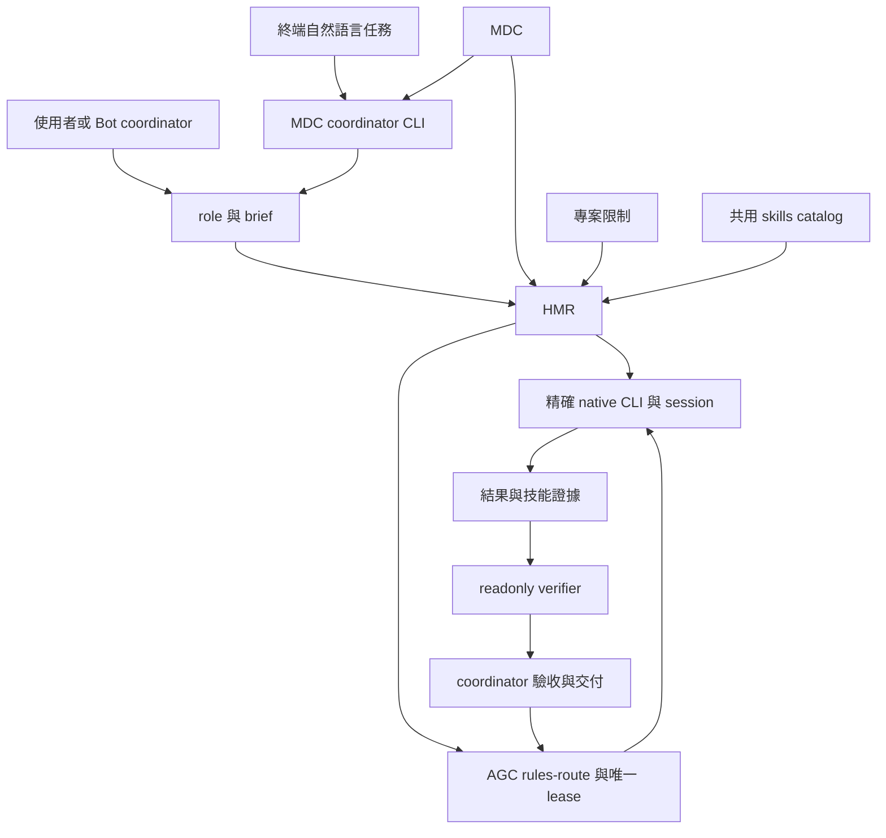
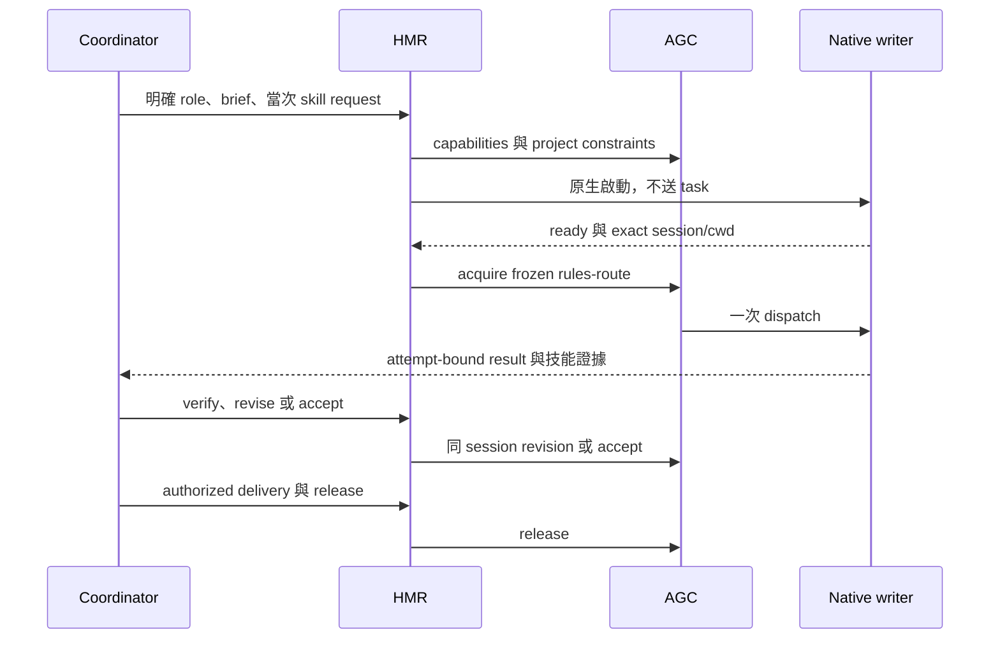
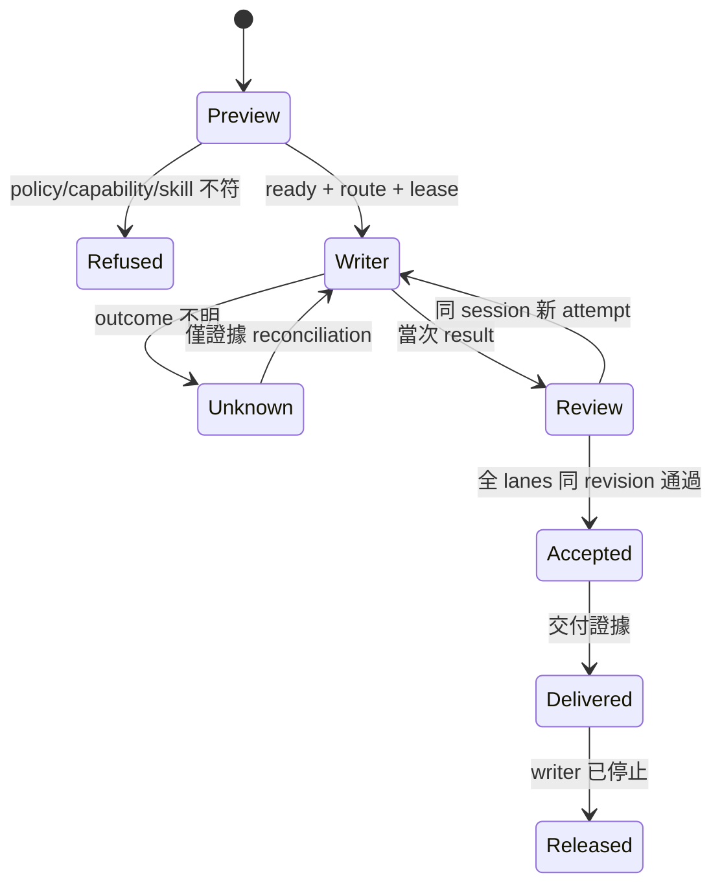

# MDC 多 provider 協作與共用技能 - Plan

## Goal Capsule

- Objective：使用者可以修改角色表來選擇 Grok、Codex 或 Claude 執行任務，並讓接手 agent 在被要求時使用相同的 pstack 技能。
- Means：沿用 HMR 的 MDC 路由，擴充 AGC 的 writer 契約與 HMR 的技能交接契約，見 KTD1、KTD3。
- Authority：使用者與目標專案的授權優先；角色規則選模型，專案政策限制可執行範圍。技能與 Bot 不新增操作授權。
- Execution：DevPro 既有原生訂閱；Codex 決策、審查及交付，Claude Opus 5.5 為本次實作的唯一 writer。
- Stop conditions：未知送達、session／cwd 身分不符、模型或技能不可用時保留證據並拒絕；不能重送、換模型、搶鎖或改用 API 計費。
- Tail ownership：Codex 持有獨立審查、CI、分級交付與後續單元。程式及協定改動按 Tier 3 處理，實際精確 head 驗收完成後才取得 Kai GO。

---

## Product Contract

### Summary

讓 MDC 選定的 Grok、Codex、Claude writer 都能使用 AGC 的協作流程。讓手動終端入口與 Bot 的 EM／DE／SWE 入口交付相同的角色、brief 與當次技能要求。

### Problem Frame

HMR 已能從 MDC 啟動多種 CLI，但 AGC 整合先限制 Claude，並另以 Claude default 比對模型。使用者修改 MDC 後仍可能遭遇不同模型政策，無法用一份角色表控制任務。

HMR 已有 coordinator skill，CLI 安裝卻不等於各 agent 載入 pstack。當前 pstack 技能讀其 repository 的 `config/model-roles.md`，HMR 讀 MDC，兩者沒有共同路由契約。被要求使用 `poteto-mode` 時，也沒有結構化的交接與執行證據。

### Key Decisions

- KD1. 支援 MDC 選 Grok／Codex／Claude writer，而非把所有 writer 角色改成 Claude。Governs R1、R2。（session-settled: user-directed — chosen over Claude-only MDC alignment: 使用者明確選擇擴充 AGC。）
- KD2. 終端只輸入任務，由 MDC 指定的協調模型解讀，再分派 writer／reviewer。Governs R3、R4。（session-settled: user-directed — chosen over manual role-only terminal entry: 使用者明確選擇訂閱 CLI 的自然語言入口。）

### Requirements

**模型與入口**

- R1. HMR rules workflow 的新 writer 由 MDC 的精確 provider、model、effort 決定；AGC 不另選預設模型，也不改寫 MDC。
- R2. 新 AGC rules-route 支援 `grok`、`codex`、`claude`；專案既有 provider／model pin 等限制仍可拒絕，但不能替換結果。
- R3. 新增終端自然語言入口，使用者只提供任務即可由 MDC 的 coordinator 角色解讀；保留現有手動 role／brief 與完全離線的預覽，不以關鍵字硬猜角色。
- R4. Coordinator 讀取角色清單，把需求轉成 brief，再由 HMR 分派 writer／reviewer。Grok Bot／Hermes Bot 的 EM、DE、SWE 可使用此入口，也可作為已有的 coordinator 直接提供 brief；不固定先開 Grok。
- R5. 模型與身分在 writer run 建立時固定；MDC 改動適用後續新任務，不在同一 session 的 revision 偷換模型。

**技能與模式**

- R6. 支援的 worker 與 verifier 能取得同一份外部 pstack 技能來源；目錄存在、檔案已讀與技能有效執行分開回報。
- R7. 當次指定 `poteto-mode` 時，交接包含技能來源、必要 reference 與明確模式要求。新 turn／revision 不用 hook 永久重啟模式。
- R8. 必要技能缺失、來源變更或所需工具不可用時回報 `blocked` 或具體 `skip`，不能聲稱完成技能。
- R9. HMR 任務的跨 provider 選擇由 MDC 決定；pstack 的 native subagent 不具跨 provider 能力時必須回報，不以另一份手動模型表覆蓋 HMR。
- R10. 結果記錄本 attempt／lane 的技能讀取聲明及執行證據；聲明不能取代 coordinator 的實際驗收。
- R11. 使用者或 Bot 提出的模式要求不新增 merge、deploy、message、secrets 或其他操作授權；沿用實際適用的使用者／專案政策。

**協作與相容性**

- R12. 保留唯一 writer authority、每 attempt 至多一次 prompt、同 session revision、所有 verifier 同 revision 通過及交付後 release。
- R13. 未知、缺少或不相容的 AGC route capability 在建立 pane 前拒絕；外部回應不明仍走現有 read-only recovery，不 replay。
- R14. 升級不改寫既有 runs、locks、owner capabilities 或 WaveFinder 的 model pins／外部鎖。既有直接 Claude 路線維持原契約。
- R15. 公開 HMR 不收錄私有 AGC 配置、個人路徑、帳戶、runtime state 或憑證。原生 CLI 仍沿用自身訂閱登入。
- R16. native trust、login、update、permission dialog 由操作者處理，不能代答或加入 bypass。

### Actors and Flows

使用者或 Bot 的協調 agent 選擇角色並建立 brief；HMR 解析 MDC、檢查專案限制及 backend capability；native CLI 提供 session 身分；AGC 擁有 lease 與 prompt sender；writer 交付結果，readonly verifier 驗證，coordinator 決定修正、驗收及交付。

同一套流程可從終端機或 Bot 的 shell／tool 呼叫開始。Hermes Bot 作為入口不等於 Hermes 是新 worker provider。

終端入口先查 MDC 的 coordinator 角色，這一步不需要先分類任務。啟動此角色的原生 CLI 後，才由該模型解讀任務、選擇有效的 writer 與 verifier roles。此原生協調步驟使用現有訂閱，不呼叫分類 API。

### Acceptance Examples

- AE1. Covers R1、R2、R5：同一角色先選 Grok，新任務再改 Codex，兩次皆使用對應 CLI；已在進行的 Grok revision 仍回原 session。
- AE2. Covers R2、R13、R14：專案明確 pin Claude，但 MDC 選 Grok，開始前清楚拒絕且沒有 pane、prompt、fallback 或規則改寫。
- AE3. Covers R6–R11：Bot 指定 poteto-mode，worker 能讀到技能與當次 playbook並回報證據；夾帶未授權 deploy 仍不會執行。
- AE4. Covers R8、R10：必要 reference 缺失或技能 digest 不符，結果不被視為符合模式要求。
- AE5. Covers R12、R13：任一 provider 的 dispatch 回應 unknown，恢復只讀現有 attempt，不另開 writer 或重送。
- AE6. Covers R3、R4：終端只輸入任務，首先啟動 MDC 明列的 coordinator CLI；它選擇角色後，writer／reviewer 使用自己的 MDC route。缺 coordinator 角色或指定模型不可用時明確拒絕，不默認 Grok。

### Scope Boundaries

本次涵蓋三種既有 provider 的 AGC 整合、共用技能交接、coordinator 使用指引與 Bot 入口契約。保留 TypeSafe 為現有付費 opt-in，不加入付費分類 API。

不新增 Hermes worker provider、Bot 身分驗證系統、排程器、API credential broker 或巢狀 writer。不同 CLI 的工具及 sandbox 能力不能因讀到同一份技能就宣稱相同。

#### Deferred to Follow-Up Work

修改 Bot 服務的部署／連線設定、發送真實 Bot 訊息及 hosted coordinator 不在此實作授權內。現有 Bot 的呼叫入口可唯讀查證並提供可直接使用的 adapter 指引；若入口原始碼不可定位，必須記錄未完成的 live integration，不假稱已接通。

---

## Planning Contract

### Key Technical Decisions

- KTD1. HMR 擁有 MDC 解析，AGC 接收版本化、不可變的 rules-route。AGC 驗證專案限制並管理 lifecycle，不重做 MDC parser。實現 KD1／R1、R2；來源是 `packages/router/src/workflow/service.ts` 與 AGC 的 `lib/agent_collab.py`。
- KTD2. AGC 新增唯讀 capabilities 握手及 legacy-policy／rules-route 的明確區分。僅新 run 使用三 provider route；舊 run 保留原語意，實現 R13、R14。
- KTD3. 共用技能依 Agent Skills 的 catalog、按需讀取方式整合。HMR 傳檔案指標及 required skills，記錄可取得、讀取聲明、實際驗收三種證據，實現 R6–R10。來源：[Agent Skills integration](https://agentskills.io/client-implementation/adding-skills-support)。
- KTD4. 模式走 brief／attempt 契約，不依賴環境變數或全域 hooks。每次 revision 明確攜帶當次模式要求；worker 不能藉技能自行呼叫 accept、release 或另開 writer，實現 R7、R11、R12。
- KTD5. HMR 啟動 CLI、完成 readiness／session 綁定後，由 AGC acquire 並成為唯一 prompt sender。route 保存 provider／kind、model／effort、canonical worktree、exact cwd、role、rules／policy digest 與 classification。不接任意 argv 或 env，實現 R5、R12、R15、R16。
- KTD6. AGC 私有來源先在 user-only staging 修改與驗證，不複製 runtime state。啟用前核對原 source digest 與相容性，限定檔案原子替換並保留 rollback；本次公開 PR 只含 HMR 與非私有 adapter 契約，實現 R14、R15。
- KTD7. 新增 `hmr start "<task>"` 原生 coordinator bootstrap，預設讀 MDC 的單 lane `coordinator` 角色，允許明確指定另一 coordinator 角色。沿用 startup／readiness、native identity 與至多一次 prompt 的規則。Coordinator 讀 model-router 指引後驅動現有 workflow，不新增分類 API或第二套完整 workflow engine，實現 KD2／R3、R4。
- KTD8. Coordinator 是控制流程角色，不能充當 source writer；它使用能呼叫 HMR 的原生工具權限，不能將它宣稱為 OS 層 read-only。HMR 仍只約束經 HMR／AGC 的 writer entrances；不經工具的直接寫檔不在 lease 控制範圍。此邊界在 prompt、metadata 與文件明示，沿用 R12，而非偷偷放寬 worker／verifier 的 readonly flags。

### Alternatives Considered

採用 KTD1 的 HMR-owned route。另一方案是 AGC 再讀 MDC、另做 Python parser並回傳選擇，會重複 inherit-parent、effort 與專案規則，增加兩份路由漂移。將 AGC 的 Claude default 當作最終模型會違反 R1。

### High-Level Technical Design

### Assumptions and Execution-Time Unknowns

- Bot 的 EM／DE／SWE 已能在 DevPro 啟動 Herdr，這是使用者提供的現況；實際呼叫程式仍需定位，不預設 Bot 使用何種服務或登入。
- 共用 pstack root 為使用者已安裝、可信任的來源。實作可依 native discovery 支援使用 link 或明確檔案 catalog，不改 Claude settings、Codex config、shell rc 或權限。
- 先保持舊的 brief/result 可讀；新增技能欄位需要清楚 schema version／相容性測試，不以放寬 strictObject 解決。
- Native CLI 通常只能證明 requested model 與啟動 argv，不能普遍證明 provider 的實際 served model；文件必須區分兩者。
- 三 provider 的 live workflow／技能能力須以實際完成證據判定；dialog 阻擋只記拒絕證據，不等同正向驗收。

---

## Implementation Units

### U1. Provider-neutral AGC route contract

- Goal：讓私有 AGC 可管理三 provider 的新 rules-route，不破壞舊 run。
- Requirements：R1、R2、R5、R12–R15。
- Dependencies：無。
- Files：AGC 私有來源 `lib/agent_collab.py`、`tests/test_agent_collab.py`、`README.md`。
- Approach：依 KTD1、KTD2、KTD5 新增 capabilities 與 route validation；保留 legacy Claude defaults、專案 pins與外部鎖 adapter。
- Test scenarios：三 kind acquire→dispatch→receipt→revision→accept→release；舊 run 相容；provider/kind/model/cwd 不符拒絕；未知版本拒絕；同 session 被換拒絕；WaveFinder pin 不符及 lock fingerprint 保留。
- Verification：私有 staging unittest 全綠，既有單次送出與外部鎖回歸通過。

### U2. HMR multi-provider AGC integration

- Goal：MDC 選定的 writer 接通 AGC sole authority。
- Requirements：R1、R2、R5、R12、R13、R16。
- Dependencies：U1。
- Files：`packages/router/src/workflow/agent-collab.ts`、`workflow/service.ts`、`workflow/identity.ts`、`test/helpers/fake-agent-collab.ts`、`test/workflow/collab-lifecycle.test.ts`、`collab-recovery.test.ts`、`writer-identity.test.ts`。
- Approach：依 KTD1、KTD2、KTD5 做 preflight 與 frozen route 傳輸，繼續使用既有 native argv、readiness、intent 與 recovery。
- Test scenarios：三 provider lifecycle，只有 AGC 送 prompt；缺 capability 在 pane 前拒絕；legacy constrained project 清楚拒絕；同 worktree 不同 cwd拒絕；MDC 中途改變不換 writer；unknown／SIGKILL 不 replay；沒有 SQLite 第二把 lease。
- Verification：公開 focused tests 與跨程序 recovery 保留，範圍內全 suite gate 通過。

### U3. Shared skill catalog and request contract

- Goal：啟動前知道 required skills 是否可取得。
- Requirements：R6–R9、R15。
- Dependencies：無，可在 U1 staging期間進行。
- Files：`packages/router/src/workflow/contracts.ts`、新增 `workflow/skills.ts`、`commands/workflow-commands.ts`、`cli.ts`、新增 `test/workflow/skills.test.ts`、`test/workflow/contracts.test.ts`。
- Approach：依 KTD3、KTD4 明確選 skills root 與 requested skills，解析合法 SKILL.md metadata及 canonical path／digest；預覽保持唯讀且不開 process／DB。
- Test scenarios：有效 symlink／重名優先序；缺 root、壞 symlink、非法 metadata、required skill 缺失清楚拒絕；只揭露 catalog／requested instructions，不載入整個技能 corpus；舊 brief 無 skills 欄位維持原行為。
- Verification：離線 plan 顯示 roles 與技能來源，effects 空；沒有讀 credential store 或傳 provider API keys。

### U4. Attempt-bound mode and skill evidence

- Goal：writer／verifier 收到當次要求，結果可被驗收。
- Requirements：R6–R12。
- Dependencies：U2、U3。
- Files：`packages/router/src/workflow/service.ts`、`workflow/contracts.ts`、`workflow/artifacts.ts`、必要的 `store/workflow-repository.ts`、新增 `test/workflow/skill-lifecycle.test.ts`、`test/workflow/standalone-lifecycle.test.ts`。
- Approach：依 KTD3、KTD4 將技能指標與模式要求放入 writer／verifier prompt及 immutable attempt metadata；receipt區分聲明與可觀察證據。
- Test scenarios：當次 poteto request；required reference缺失 blocked；舊 attempt/lane/revision 或 digest不符不能 accept；revision 不暗中永久 re-arm；worker無 coordinator authority；Bot模式不授權deploy；工具不可用的skip須能被coordinator評估。
- Verification：三 provider 的 synthetic worker均能回傳受驗證的 skill evidence；模式適用與授權判斷有非空、非 implementation-mirror 的行為測試。

### U5. Coordinator and Bot entry instructions

- Goal：使用者與 EM／DE／SWE 能依相同契約驅動 HMR。
- Requirements：R3、R4、R7、R9、R11。
- Dependencies：U3、U4。
- Files：`skills/model-router/SKILL.md`、`skills/model-router/references/workflow.md`、`skills/model-router/test/prompts.md`、`skills/model-router/test/skill.test.ts`、`README.md`、`docs/rules.md`、`docs/operations.md`、新增非私有 Bot brief example。
- Approach：說明外部 coordinator解讀需求、HMR查 MDC、AGC管理writer；提供 terminal與Bot的相同brief例子，技能按需載入，來源失敗不能宣稱已啟用。
- Test scenarios：使用者提供明確role；Bot提出自然語言任務時先讀roles再生成有效brief；無role不猜；mode與操作授權分開；MDC和native subagent能力衝突回報，不生成另一份全域模型決策。
- Verification：behavioral skill evaluation通過；已安裝的 coordinator可讀model-router指引，未定位Bot服務標為未驗證。

### U6. Native acceptance and safe activation

- Goal：三種 writer與技能交接經原生驗收，安全更新本機工具。
- Requirements：R6、R8、R10、R12–R16。
- Dependencies：U1–U5、U7。
- Files：`docs/provider-support.md`、`CHANGELOG.md`、私有 staging 的 source hash／rollback及native evidence，不能加入公開git。
- Approach：先以 staged AGC launcher、獨立 fixture state驗收；legacy active run不得改寫。核對原來源未變、必要gate通過後才原子啟用限定檔案。
- Test scenarios：每provider真實寫fixture、同session修正、readonlyverify、accept／delivery／release；poteto file-read與playbook行為證據；startup dialog零prompt；unknown零replay；existing legacy run／pin／lock routing不變。
- Verification：公開 `npm run verify`、私有unittest、獨立Sonnet review、Codex ACCEPT、GitHub CI與Tier3精確head Kai GO；Bot live entry若不能驗證，保持該項未完成。

### U7. Native natural-language coordinator entry

- Goal：使用者在終端輸入任務，MDC 指定的 coordinator 解讀並分派角色。
- Requirements：R3、R4、R6、R7、R9、R11–R13、R15、R16。
- Dependencies：U2–U5。
- Files：新增 `packages/router/src/commands/start.ts`、`cli.ts`、必要的 coordinator launch／store 模組與 migration、`rules/native-argv.ts`、新增 `test/cli/start-cli.test.ts`、`test/workflow/coordinator-bootstrap.test.ts`、`skills/model-router/SKILL.md`、`README.md`、examples 角色表。
- Approach：依 KTD7、KTD8 先解析 coordinator 模型，再交付原始任務、可用 roles 與 skill 指標。保留其精確 native session、cwd、prompt attempt；未知送達不可重啟。Coordinator 選角色、組 brief，再使用既有受 gate 的 workflow。Bot 已有 coordinator 時不強迫再開同角色。
- Test scenarios：只給 task 啟動 MDC coordinator，沒有隱藏 Grok／TypeSafe；coordinator 角色缺失、panel、inherit-parent 未提供 parent或policy衝突時拒絕；dry-run無 process、network、DB；原始任務及模式要求完整傳遞；unknown不重送；同 worktree重複啟動不產生雙 coordinator／writer；worker不能假冒 coordinator；最終證據分開區分 bootstrap started、角色分派與任務完成。
- Verification：離線與fake CLI 行為測試通過；原生coordinator能讀技能、理解合成任務並透過HMR分派正確role，不能只用啟動成功當作全流程完成。

---

## Verification Contract

### U8. Native Codex startup identity

- Goal：Codex 尚未觸發 SessionStart hook 時，仍能在第一次任務派送前取得真實身分。
- Requirements：R5、R12、R15、R16。
- Evidence：目前 CLI 在 ready 狀態沒有 Herdr session，native `/status` 已顯示 UUID；第一個不使用工具的診斷回應後，SessionStart hook 回報相同 UUID。不能用生成的 UUID、推測最近 session 或先派送 writer 任務來處理。
- Decision：只有 Codex 已 ready、kind／cwd／agent identity 符合且 session 缺失時，可執行原生唯讀 `/status` 啟動查詢，從該 pane 的 UI 擷取唯一 UUID，透過 Herdr 的 session report API 登記並讀回驗證。這不是模型交辦；original task 仍只送一次。已有 session 時完全略過查詢。Hook 後續回報必須與綁定身分相同。
- Scope：native launch adapter、必要的 Herdr client port、synthetic startup tests、operators docs；不改 provider login、模型、permissions 或 native hook 的安全 guard，不讀 transcript／credential files，不保留 status 的帳戶或用量內容。
- Verification：離線 tests 證明查詢只在正確邊界執行、無原始任務重送，缺少／多個／不符的 UUID 都拒絕；原生 Codex coordinator 與 writer 的後續 hook UUID 和綁定一致，工具 context 為實際新 pane。
- Native regression：首次查詢安全拒絕，因共享 input parser 把 `48;2;65;69;76` 的 RGB 參數 `2` 當成 SGR dim，導致實際 `/status` 被視為空白。修正須跳過 extended color 子參數，保留真正 dim placeholder 的辨識；不能略過 echo gate 或把任何文字都當成可送出。

公開檢查使用 `npm run verify`；私有 AGC 使用 staged source 的 `python3 -m unittest discover -s tests -p 'test_*.py'`，不接真實資料或憑證。先做針對新契約的行為測試，最後在必要 gate 跑完整 suite，不因技能疊加重跑相同證據。

獨立審查必須涵蓋 route provenance、exact cwd／session、race／unknown recovery、skills與authority分離、legacypins／locks及公開內容衛生。原生驗收與stub測試分開報告；provider因dialog未完成不能標成live pass。

## Definition of Done

U1–U8 的結果與驗證證據寫入本計畫的交付紀錄。三 provider 的新rules-route可工作，既有legacy流程不受破壞，requested skills可按任務傳遞且缺失不會誤判。使用者只輸入任務時由MDC coordinator完成解讀及角色分派。公開PR只含reviewed source／docs／tests，所有 gate通過並依授權交付；私有工具有可回復備份，已完成lease與pane cleanup，無遺留實驗程式。

## Delivery Evidence

U8 與原生修正已完成 898 個測試的完整 gate；Codex 延遲刷新與 UUID 換行都有針對性 red／green tests，從真實 UI 擷取 UUID 後經 Herdr 的 `herdr:codex` 支援來源登記並讀回。獨立 Sonnet 已審查，Codex 新 coordinator 的工具 cwd／pane／thread 均與實際綁定一致。Grok 的兩 attempt 原生 writer／reviewer、poteto 第一交辦套用與第二交辦未 re-arm、local delivery 及 lease release 已驗收；預設 Codex coordinator 正在執行 Claude bug-fix 與 Codex code-generation 的序列流程，尚未宣稱全部完成。

使用者已在本次任務明確授權處理必要 CLI 提示、安裝 Grok／Herdr 整合，並持續到經審查與 CI 通過後合併及 DevPro 本機啟用，不再逐步確認。此授權涵蓋本任務必要修正後的最終 head；品質 gate、精確 head 比對、既有訂閱與單 writer 規則保留。Grok integration 已安裝，新的 bootstrap 已取得真實 session ID 並派出 writer，沒有偽造 session 或放寬身分 gate。

原生驗收確認需要補正 R7：原始 brief 的 mode 必須列入 required，但不能因此在未 re-arm 的 revision 保持強制套用。新增設計澄清：snapshot 中原始 mode 的 required 義務只在該 attempt 的 modes 包含它時生效；一般 required skills 維持每次交辦的義務，revision 明確新增的 mode 仍需套用。inactive mode 只提供來源指標，不能透過 prompt 標籤或驗收 gate 自動重新啟用。Codex 的純函式 probe 已重現缺陷，修正回到同一 Opus writer，private AGC 不需要改動。

U1–U5、U7 已完成第一輪實作，尚未驗收交付。DevPro 的同一個 `claude-opus-5-5` session 實際執行 ce-work return-to-caller，`npm run verify` 通過 91 個 test files、824 個 tests。私有 staged AGC 通過 146／148 個 tests，另外兩項缺少 staging 的 entrypoint／真實專案設定；既有設定只會以唯讀方式驗證，不複製設定或憑證。

獨立 Sonnet ce-code-review 已完成 report-only 審查；未執行 cross-model peer，不能宣稱跨模型審查通過。Codex 已確認需要修正 coordinator 的 rules／parent／runtime 傳遞、技能來源邊界、writer／verifier evidence gate、attempt artifact 缺失與 coordinator close 的競態。修正回到同一 writer session，保留 AGC lease。

U6 尚未完成。三 provider 原生 workflow、自然語言 coordinator 的實際角色分派、工具 Herdr context 與 poteto 行為證據、CI、精確 head Kai GO、工具啟用與 cleanup 都待完成。已定位 `agent-orchestration` 的 Hermes → DevPro Herdr source contract；Grok EM／DE／SWE 的真實 gateway 與遠端技能部署仍未驗證，不能宣稱所有 Bot 已接通。此紀錄由 Codex 維護，Claude 實作不編輯 `docs/plans/`。

同 session 的 a2 修正已完成，`npm run verify` 通過 92 個 test files、858 個 tests；staged AGC 在直接唯讀驗證既有 project config 的設定下通過 150／150。獨立 Sonnet 的針對性驗證沒有發現修正回歸。Codex 另以純函式 probe 核對 waiver 語意，澄清文件：明確豁免整個 skipped skill 不代表已讀 references；`applied` 聲明仍須吻合所有 reference digest，bound source 缺失或變更仍不可豁免。這次只改說明與註解，沒有變更 gate 行為。

隔離的原生 dry-run 已確認自訂 rules、actual-parent、46 個 pstack catalog entries 與空 effects；runtime home 未產生檔案。原生 Codex 在更新提示停止，Claude 在新測試目錄的 trust 提示停止。兩次 HMR bootstrap 都記為 failed、沒有 prompt、建立的 pane 已關閉；這是 refusal 證據，不是正向通過。另開的 setup pane 保留提示供使用者處理，已提出僅 Skip 更新／信任隔離測試目錄的具體授權問題。U6、最終 ACCEPT、merge 與啟用保持未完成；先發布 draft PR 供審查及 CI，不把草稿視為交付。
